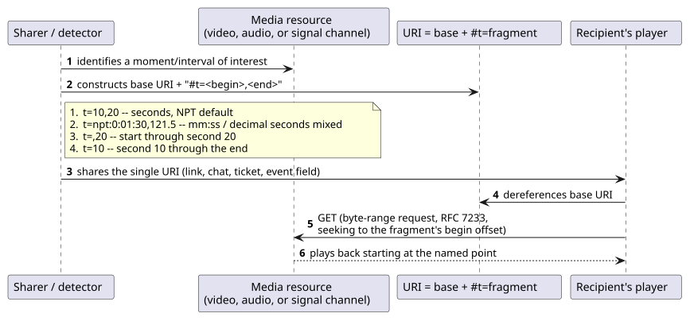
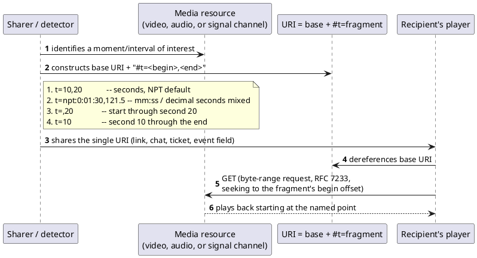

[← Pattern index](README.md)

# Deep-Linking via Temporal Fragment URIs

## The pattern

Give a specific point or interval *within* a media/signal resource a
stable, shareable URI, instead of only being able to link to the
resource as a whole. A plain URL already lets you link to a whole
video, audio file, or recorded signal; without a standard convention,
"link to the part at 1:30–2:00" becomes a bespoke, non-interoperable
query parameter every application invents differently (`?start=90`,
`?t=1m30s`, `?clip=90-120`...). The **W3C Media Fragments URI**
specification standardizes this: appending a URI *fragment*
(`#t=...`) names a temporal range within the resource the base URI
already identifies, using **Normal Play Time (NPT)** by default —
`#t=10,20` is the half-open interval from second 10 up to (not
including) second 20; `#t=,20` is from the start to second 20;
`#t=10` is from second 10 to the resource's end. NPT also accepts
`mm:ss`/`hh:mm:ss` forms (`#t=npt:0:01:30,121.5`), and the same
fragment scheme separately defines spatial (`#xywh=`), track
(`#track=`), and named (`#id=`) dimensions for the same media
resource — temporal addressing is only one of the four.

**Source:** [W3C Recommendation, *Media Fragments URI 1.0 (basic)*, 25 September 2012](https://www.w3.org/TR/media-frags/) — verified directly against the published spec text.

## When you'd reach for it

Any time a user, an alert, or an automated process needs to point at a
*moment* within a stream or recording rather than the whole thing — a
scrub-bar deep link, an anomaly detector's "here's where it happened"
reference, a citation into a recorded call, or an annotation on a
signal capture. Reach for the W3C syntax specifically once the
resource is already addressable as a media object (video, audio, or
any timestamped-sample stream) and the alternative under
consideration is inventing a one-off query-string convention that
means nothing outside the one application that defined it.

## Cost

The temporal fragment itself doesn't fetch anything — a URI fragment
is never sent to the server in an HTTP request (it's resolved entirely
client-side), so the *actual* seek to that offset still depends on
the resource supporting real random access underneath (byte-range
requests, `ADR-031`/`ADR-032`'s adjacent pattern) — the fragment is
only the addressing convention, not the seeking mechanism. The basic
profile also only defines *player-side* seeking semantics; a server
that wants to serve back exactly the requested sub-range as its own
HTTP response (rather than the whole resource, seeked client-side)
needs the separate advanced Media Fragments URI profile or an
equivalent server-side range-mapping step — not something the basic
`#t=` syntax alone guarantees a server implements.

## How this application uses it

`ADR-031` adopts the W3C Media Fragments URI temporal syntax for
deep-linking into a `TelemetryChannel`, specifically because it is the
same shape `TelemetryPointer`'s `{FromTimestamp, ToTimestamp?}`
envelope field already has — a deep-link URI and an internal
`TelemetryPointer` are trivially interconvertible, not two independent
representations of the same idea. `src/EventStore.Streaming/MediaFragmentResolver.cs`
implements the resolution side: it parses a `#t=` fragment via
`MediaFragmentUri.TryParse`, resolves the begin/end seconds relative to
the target channel's earliest ingested sample (the same reference
point a video player's own scrub bar would seek within), and returns
the equivalent `TelemetryPointerEntry` directly — the same object shape
a detector's published event already carries in its `TelemetryPointer`
field, exactly the "interconvertible" framing `ADR-031` calls for.
