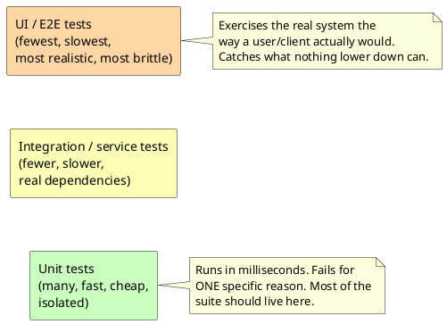

[← Pattern index](README.md)

# Test Pyramid

## The pattern

Shape a test suite like a pyramid, not a uniform stack: many fast,
cheap, narrowly-scoped unit tests at the base, exercising individual
functions/classes in isolation; fewer, slower integration/service
tests in the middle, exercising real components talking to real
dependencies (a database, a message broker); and the fewest, slowest,
most brittle end-to-end/UI tests at the top, driving the whole system
the way a real user or client would. The shape follows directly from
cost and stability: a test closer to the base fails for one specific
reason and runs in milliseconds; a test near the top can fail for
dozens of unrelated reasons (a flaky selector, a slow network, an
unrelated service being down) and runs orders of magnitude slower — so
a healthy suite deliberately has far more of the cheap, stable kind and
relies on the expensive, fragile kind only for what nothing lower down
can actually prove (that the pieces genuinely work *together*, through
the real interfaces a user or client actually uses).

**Source:** Mike Cohn, in [*Succeeding with Agile: Software Development
Using Scrum*](https://www.mountaingoatsoftware.com/books/succeeding-with-agile-software-development-using-scrum)
(2009) — Cohn had drawn the shape informally in conversation with Lisa
Crispin as early as 2003–4 and described it at a Scrum gathering in
2004, but the book is the citable, formal origin. Martin Fowler's own
[bliki entry, "TestPyramid"](https://martinfowler.com/bliki/TestPyramid.html),
is the most widely cited restatement and is largely responsible for how
far the term spread beyond Cohn's own book.

## When you'd reach for it

Whenever a project has -- or is starting to accumulate -- more than one
tier of automated test and needs a shared vocabulary for "how much of
which kind do we actually want," or when an existing suite feels slow
and flaky and the fix is redistributing coverage downward (turning an
E2E test that's really only checking one function's logic into a unit
test) rather than simply adding more tests of whichever kind is easiest
to write next.

## Cost

The pyramid is a *shape* to aim for, not a guarantee that unit tests
alone prove the system correct — a suite that is all unit tests and no
integration/E2E coverage can pass completely while the pieces still
fail to work together through their real interfaces, the exact gap the
upper tiers exist to close. Following the shape also takes discipline
against the easier default: an E2E test is often the *first* one a
team reaches for because it most resembles "does the feature work,"
and only deliberate redistribution keeps the suite from inverting into
an "ice cream cone" (many slow, flaky E2E tests and few unit tests) —
a known, named failure mode of not following this pattern, not a
strawman. The pyramid shape itself has also drawn real, more recent
critique for treating "unit" as a single undifferentiated bottom tier
when sociable/solitary unit tests can have very different costs — worth
knowing the shape isn't the last word on test-suite economics, even
though it remains the standard starting vocabulary.

## How this application uses it

`ADR-055` adopts the pyramid directly, one concrete tool per tier:
`MSTest` for backend unit tests (`Moq` was decided but, per the very
next paragraph, never actually needed — corrected here, a design-
compliance audit this session caught this doc's own opening clause
still asserting Moq as a live tool, contradicted three sentences later
by its own citation) and `Vitest`+`Vue Test Utils` for
frontend unit tests at the base; the existing `Testcontainers`-based
`EventStore.IntegrationTests` suite (already exercising the framework's
real HTTP/GraphQL surface against real SQLite/Postgres/SQL Server
instances, not mocks) in the middle; and `Playwright` (via
`EventStore.E2ETests`, using MSTest's own base classes so one
runner/assertion stack spans every tier) at the top, driving `ADR-039`'s
Vue/MVVM client through a real browser against a real running
deployment. `ADR-055`'s own record is a candid instance of the "aim for
the shape, verify it's actually built" discipline this project applies
everywhere: an audit this session found the unit-test tier (`Moq`
specifically) had zero actual usage anywhere in the codebase despite
being decided, tracked the gap explicitly rather than letting the ADR
silently overclaim, and confirmed `EventStore.UnitTests` was finally
built for real once `ADR-063` gave it concrete content (`FsCheck`
property tests, hand-rolled fault injection, and ordinary unit tests).
`EventStore.E2ETests` also extends past ADR-055's original scope with
`PlaybookRecorder` — capturing a numbered screenshot at each step of a
real user workflow and assembling them into a markdown playbook under
`docs/playbooks/` — a documentation use for the same top-tier E2E
infrastructure, not a change to the pyramid's own shape.
