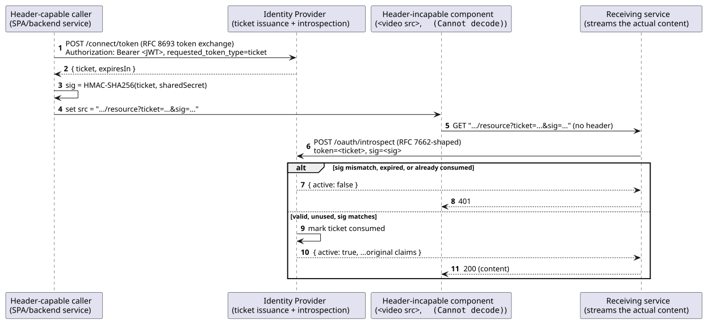
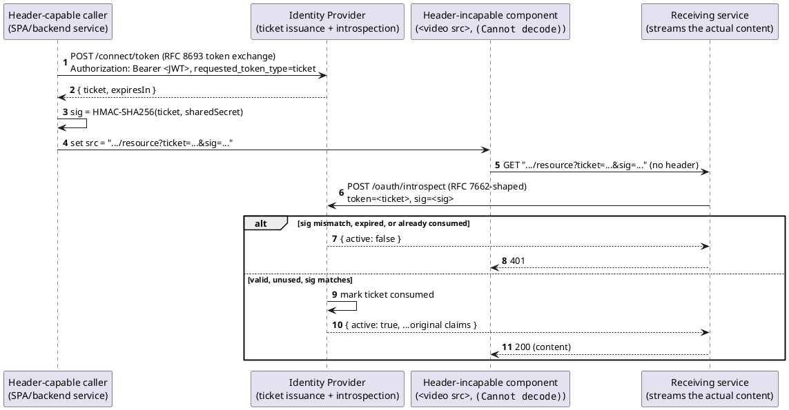

[← Pattern index](README.md)

# Ticket Exchange for Header-Incapable Clients

## The pattern

Some HTTP callers cannot attach a custom header to their request at
all — an HTML `<video src>`/`<audio src>`/`` element, a browser
`EventSource`, a WebSocket handshake, an `<a href>` pointing directly at
a content-addressed download URL. Yet the *application* embedding that URL usually
**can** authenticate normally moments earlier. The pattern: the
header-capable party exchanges its normal credential for a short-lived,
single-use, opaque **ticket** ahead of time, signs that ticket with a
secret only it holds, and embeds ticket+signature — never the original
credential, never the secret — into the URL the header-incapable
component will actually fetch. The receiving service never verifies the
signature itself; it forwards ticket+signature to a trusted backend,
which resolves the ticket back into the original credential's claims.

## Also known as

**CAS (Central Authentication Service) service tickets** — the closest
named prior art: a short-lived, URL-embeddable ticket that the *receiving*
service validates by calling back to a trusted authority
(`/serviceValidate`), rather than validating locally. **Signed URLs /
presigned URLs / token authentication** (AWS CloudFront, Google Cloud
CDN, Azure SAS, BunnyCDN/nginx `secure_link`) — the HMAC-over-a-URL
half specifically, an established industry convention rather than a
single numbered standard. **Reference tokens**, resolved via **OAuth 2.0
Token Introspection (RFC 7662)** — the "opaque string, ask a backend what
it means" half. None of these three, alone, covers the whole shape; this
pattern is their composition.

## When you'd reach for it

Exactly when a URL — not a request you fully control — is the only
transport available, and the alternative would otherwise be putting a
real, long-lived, high-value credential directly in that URL (which
leaks via access logs, browser history, `Referer` headers, and proxy/CDN
caches indefinitely, or until it naturally expires). If the caller can
set a header, use a header — this pattern is strictly a fallback for
the cases where it genuinely can't, not a general convenience API.

## Cost

A second round-trip (issue the ticket, then use it) before the
header-incapable component's request can even begin. An identity
provider that must track short-lived, single-use ticket state (however
minimal) alongside ordinary token issuance. And an honest residual risk:
single-use consumption limits — but does not eliminate — replay if a
*complete* URL (ticket and signature together) leaks through the very
channels this pattern exists to avoid handing a raw credential to.

## How this application uses it

`ADR-040` is this pattern, composed from three primitives this design
already had reasons to trust independently: ticket issuance reuses
`ADR-036`'s OAuth 2.0 Token Exchange (RFC 8693) machinery unchanged
(a new `requested_token_type` value, nothing else); resolution is an
RFC 7662-shaped introspection call, extended with the signature
parameter; the client-side signing step borrows the same HMAC-over-a-URL
convention CDNs use for signed content URLs, with no single spec behind
it. Applied specifically to `ADR-031` (streaming channel playback via
`<video>`/`<audio>` elements) and `ADR-032` (attachment retrieval via
``/`<a>` elements pointing directly at a content-addressed URL,
without full custom-header support) — the two places in this
design where a URL, not a request, is genuinely the only transport.

**Not a Bearer/DPoP replacement**: every other endpoint in this design
keeps authenticating exactly as `ADR-006`/`ADR-017` specify. This
pattern is additive, for a named capability gap, not a system-wide
alternative.

**The mistake this design already made once, and isn't repeating**:
`ADR-006` originally carried a raw `access_token`-in-URL workaround for
`EventSource`-based Follow (which also can't set headers); `ADR-012`
removed it once Follow moved to `fetch()`, specifically because a bare
bearer token in a URL is the exact leak risk described above. `ADR-040`
solves the *same class* of problem — a header-incapable caller —
without reintroducing that specific mistake: what travels in the URL is
an opaque, single-use, non-self-describing ticket, never the credential
itself.
