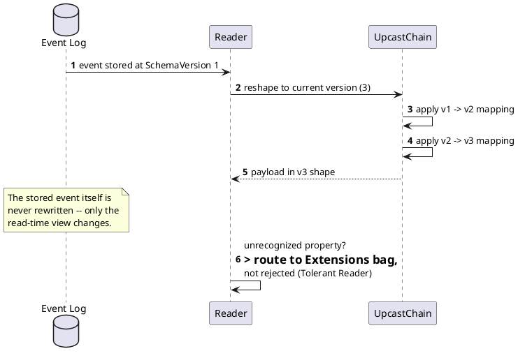

[← Pattern index](README.md)

# Tolerant Reader & Schema Evolution

## The pattern

**Tolerant Reader** — a consumer of another service's data should extract
only what it needs and ignore everything it doesn't recognize, rather
than validating strictly against an exact expected shape. This lets a
provider add fields, restructure unrelated parts of a payload, or ship
independently of consumers, without breaking anyone who was already
tolerant. **Source:**
[Martin Fowler — Tolerant Reader](https://martinfowler.com/bliki/TolerantReader.html),
which grounds the pattern explicitly in **Postel's Law** — "be
conservative in what you do, be liberal in what you accept from others"
(originally a networking-protocol principle, RFC 760/1122's author Jon
Postel).

**Schema evolution / upcasting** — once data has been Tolerant-Reader-safe
to *receive*, a system that keeps history around (see
[Event Sourcing](event-sourcing.md)) still needs a story for
*reconciling* old-shaped data with a newer schema at read time, since old
records can't be silently rewritten without falsifying history. The
general answer is a **version-to-version transform** applied on read
(sometimes called upcasting), keeping the stored record untouched.

## How this application uses it

**Tolerant Reader** shows up as this design's `Extensions`-bag routing
(`ADR-022`): a property the receiving schema doesn't recognize is folded
anyway, just routed to an overflow bag instead of a typed slot — the
payload as a whole is never rejected over one unfamiliar field. `ADR-023`
extends the same posture to the *whole* payload: an unknown or invalid
shape is persisted and flagged (`SchemaStatus`), never dropped — a
stronger, system-wide commitment to the pattern than "just ignore unknown
JSON keys."

**Upcasting** is `ADR-018`: `upcastFromPrevious`, a mapping expression
registered per schema version, applied read-time by `UpcastChain` to
reshape an old-version payload into the current version's fields —
`StoredEvent.Payload` is never rewritten; the transform runs fresh per
read. `ADR-020` layers a live compatibility check onto the same
mechanism at publish time, using each real lagging-version publish as its
own test case rather than needing synthetic test data.

**Not yet built, tracked as a queued ADR (`ADR-032`)**: the wider
compatibility/deployment discipline the second design package
(`docs/design-docs/11`) names explicitly — **Expand/Contract (Parallel
Change)** migrations (only ever add columns/tables, never alter or drop,
so rolling back a deployment is just running the old binary against a
database shape it still fully understands) and an **N-1/N+1 compatibility
window** (any server version must correctly process events tagged with
the immediately-prior and immediately-next schema version, not just its
own). These generalize Tolerant Reader from "don't break on unknown
fields" to "don't break on unknown *deployments*," and are worth reading
about even before `ADR-032` lands, since `ADR-018`'s upcast chain is
already most of the mechanism they'd need.
