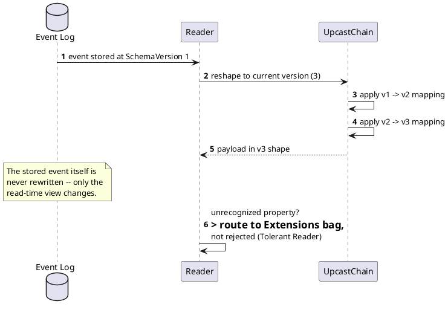

[← Pattern index](README.md)

# Tolerant Reader & Schema Evolution

## The pattern

**Tolerant Reader** — a consumer of another service's data should extract
only what it needs and ignore everything it doesn't recognize, rather
than validating strictly against an exact expected shape. This lets a
provider add fields, restructure unrelated parts of a payload, or ship
independently of consumers, without breaking anyone who was already
tolerant. **Source:**
[Martin Fowler — Tolerant Reader](https://martinfowler.com/bliki/TolerantReader.html),
which grounds the pattern explicitly in **Postel's Law** — "be
conservative in what you do, be liberal in what you accept from others"
(originally a networking-protocol principle, RFC 760/1122's author Jon
Postel).

**Schema evolution / upcasting** — once data has been Tolerant-Reader-safe
to *receive*, a system that keeps history around (see
[Event Sourcing](event-sourcing.md)) still needs a story for
*reconciling* old-shaped data with a newer schema at read time, since old
records can't be silently rewritten without falsifying history. The
general answer is a **version-to-version transform** applied on read
(sometimes called upcasting), keeping the stored record untouched.

## When you'd reach for it

Any integration where the provider and consumer deploy independently —
Tolerant Reader specifically whenever a consumer can't guarantee it will
be redeployed in lockstep with every upstream shape change; schema
evolution/upcasting specifically once a system keeps history around long
enough that "the schema changed since this record was written" becomes
a certainty rather than an edge case.

## Cost

Tolerant Reader means a consumer can silently keep working against a
provider that's already changed in ways the consumer doesn't know about
— robustness can mask a real integration break instead of surfacing it.
Upcasting means every read pays a transform cost proportional to how many
versions behind a given record is, and the transform chain itself
becomes something that must be kept correct and tested at every version
boundary, forever, not just at the moment a new version ships.

## Also known as

**Postel's Law** is also called the **Robustness Principle** — the same
"be conservative in what you send, liberal in what you accept" rule,
under its more common name in networking-protocol contexts (its origin)
versus Fowler's application of it to service integration specifically.
Related but distinct: **Consumer-Driven Contracts** — a *testing* practice
(consumers publish the shape they actually depend on, providers test
against it) that complements Tolerant Reader rather than being another
name for it.

## How this application uses it

**Tolerant Reader** shows up as this design's `Extensions`-bag routing
(`ADR-022`): a property the receiving schema doesn't recognize is folded
anyway, just routed to an overflow bag instead of a typed slot — the
payload as a whole is never rejected over one unfamiliar field. `ADR-023`
extends the same posture to the *whole* payload: an unknown or invalid
shape is persisted and flagged (`SchemaStatus`), never dropped — a
stronger, system-wide commitment to the pattern than "just ignore unknown
JSON keys."

**Upcasting** is `ADR-018`: `upcastFromPrevious`, a mapping expression
registered per schema version, applied read-time by `UpcastChain` to
reshape an old-version payload into the current version's fields —
`StoredEvent.Payload` is never rewritten; the transform runs fresh per
read. `ADR-020` layers a live compatibility check onto the same
mechanism at publish time, using each real lagging-version publish as its
own test case rather than needing synthetic test data.

**`ADR-038`** is the wider compatibility/deployment discipline, adopted
directly from the second design package's own naming of it — **Expand/
Contract (Parallel Change)** migrations (only ever add columns/tables,
never alter or drop, so rolling back a deployment is just running the
old binary against a database shape it still fully understands) and an
**N-1/N+1 compatibility window** (any server version must correctly
process events tagged with the immediately-prior and immediately-next
schema version, not just its own). These generalize Tolerant Reader from
"don't break on unknown fields" to "don't break on unknown
*deployments*," building directly on `ADR-018`'s upcast chain as most of
the mechanism they need.
