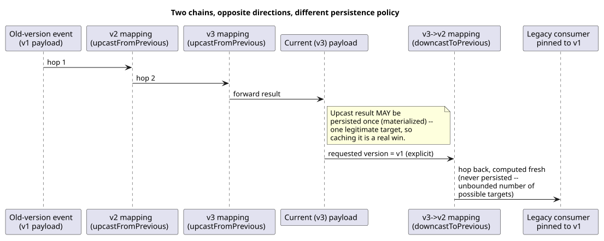
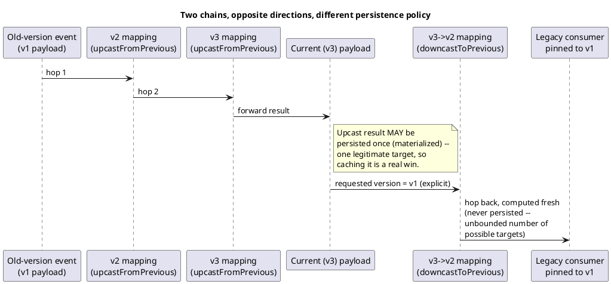

[← Pattern index](README.md)

# Upcast/Downcast Schema Mapping

## The pattern

When a piece of stored data's shape (schema) has evolved over time,
give a reader two explicit, symmetric transforms rather than one: an
**upcast** (forward map, old shape → current shape) for a consumer that
wants everything in today's shape regardless of when it was written,
and a **downcast** (backward map, current shape → an older shape) for a
consumer that hasn't upgraded yet and still only understands an earlier
version. The two directions are asymmetric in a way worth treating
differently: a forward map has exactly one legitimate target (the
current version), so computing it once and persisting the result is a
bounded, worthwhile investment — every future reader just uses the
already-computed answer instead of re-deriving it. A backward map has
as many potential targets as there are historical versions still in use
by however many lagging consumers happen to exist, so persisting every
version-pair combination anyone might ever ask for is unbounded,
likely-wasted work; computing it fresh, on demand, per request, is the
right trade specifically because the target isn't fixed the way the
forward direction's is.

**Source:** the general shape — declare per-version mapping rules and
apply a chain of them hop-by-hop between adjacent versions, rather than
one big mapping between every version pair — is directly adjacent to,
though not identical to, **Apache Avro's own schema resolution rules**
([Avro specification](https://avro.apache.org/docs/1.11.1/specification/)):
Avro resolves a *writer's schema* against a *reader's schema* at
deserialization time — a field present in the writer's data but absent
from the reader's schema is ignored, and a field the reader's schema
declares with a default, but the writer never wrote, is filled from that
default. Avro's resolution is a single reader-vs-writer negotiation
computed at read time with no persisted intermediate result and no
concept of a deliberate multi-hop chain through every intervening
version — the adjacency is in the *problem* (reconciling two schema
versions of the same logical record) and in Avro's shared principle that
the writer's schema must always travel with the data so any reader can
resolve against it, not in an identical mechanism.

## When you'd reach for it

Any long-lived event or record schema that changes shape over its
lifetime while old data must stay both replayable in the current shape
(upcast) and consumable by integrations that haven't upgraded yet
(downcast) — a durable event log being replayed by a projection that
only wants one consistent shape, or a legacy API integration still
pinned to a schema version the rest of the system has moved past.

## Cost

Every version bump that reshapes a field needs its mapping written
(and, for upcast specifically, validated) at registration time, and the
chain-of-hops design means an old event N versions behind pays for N
hops of transform on every live read that doesn't use a materialized
result. The mapping expressiveness is also a deliberate ceiling, not a
gap: a narrow, declarative "expression `as` alias" shape only covers
reshaping one event's own sibling fields (rename, recompute, combine) —
it cannot fan one field out into several (one-to-many) or join across
records (many-to-many); a version change that genuinely needs either of
those needs a different, heavier mechanism entirely.

## How this application uses it

`ADR-018` defines the forward direction: each schema version `>= 2` may
declare an `upcastFromPrevious` expression list, evaluated hop-by-hop by
[`src/EventStore.Upcasting/UpcastChain.cs`](../../src/EventStore.Upcasting/UpcastChain.cs)
via the pluggable `IUpcastExpressionEvaluator` seam (CEL by default,
`ADR-053`). `ADR-028` adds the mirrored backward direction — an optional
`downcastToPrevious` mapping per version, walked hop-by-hop by
[`src/EventStore.Upcasting/DowncastChain.cs`](../../src/EventStore.Upcasting/DowncastChain.cs)
— triggered only by an explicit request for an older version, never a
default, and **deliberately never materialized**, unlike the forward
direction. `ADR-027` is what actually persists the forward map's result:
a successful live upcast at publish time (or a background
reconciliation pass over the existing backlog) is written back to the
log as a new `StoredEvent` with `EventKind = UpcastMaterialization`,
implemented in
[`src/EventStore.Router/UpcastMaterializer.cs`](../../src/EventStore.Router/UpcastMaterializer.cs)
(`TryMaterializeAsync`, `ReconcileBacklogAsync`). The critical invariant
`ADR-027` states explicitly: a materialization is never folded into the
Entity Store — folding continues to consume only `Original` events,
running `UpcastChain` live exactly as `ADR-018` specifies, so a
materialization can never re-apply a stale value on top of newer data
that has since changed the same property.
