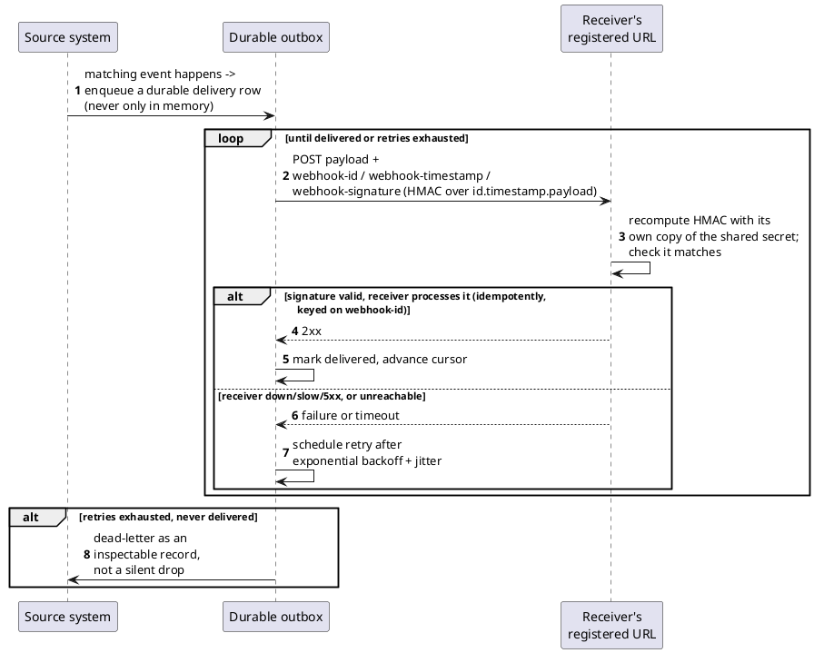

[← Pattern index](README.md)

# Webhook delivery with HMAC signing and retry

## The pattern

A webhook is push-based outbound notification: instead of a consumer
polling for changes or holding an open connection, the source system
calls out to a URL the consumer registered in advance, the moment a
matching event happens. The bare idea — "call this URL when X happens" —
has existed informally since Jeff Lindsay coined the term in 2007
([Wikipedia: Webhook](https://en.wikipedia.org/wiki/Webhook)), but every
production implementation of it has to answer the same three questions
the bare idea leaves open: how does the receiver know the call really
came from the claimed source and not an attacker who guessed the URL
(**signing**); what happens when a delivery attempt fails because the
receiver is briefly down or slow (**retry with backoff**); and what
happens when retries are exhausted and the receiver still hasn't gotten
it (**dead-lettering**, rather than the delivery silently vanishing).
Because nearly every real provider (Stripe, GitHub, DocuSign, and many
others) converged independently on the same answers — HMAC-sign a
payload with a shared secret, retry with exponential backoff and jitter,
record delivery failures as inspectable data — those answers were
eventually written down as one shared, adoptable specification rather
than left as folklore each provider reinvents from scratch.

**Source:** [Standard Webhooks
specification](https://github.com/standard-webhooks/standard-webhooks/blob/main/spec/standard-webhooks.md)
— an open-source, Apache-2.0-licensed spec initiated by Svix, with a
technical steering committee that includes Zapier, Twilio, Mux, ngrok,
Supabase, and Kong, and further adopters including OpenAI, Google
Gemini, PagerDuty, and Etsy. It standardizes exactly the three questions
above: `webhook-id`/`webhook-timestamp`/`webhook-signature` headers,
HMAC-SHA256 over `{id}.{timestamp}.{payload}`, and a recommended
exponential-backoff-with-jitter retry schedule.

## Also known as

**Push-based notification / callback URL** are the generic, pre-spec
names for the bare idea. **Standard Webhooks** (this pattern's cited
source) is a specific, real specification that standardizes the
signing/header/retry shape — not itself a synonym for "webhook" in
general, since plenty of webhook implementations predate it and don't
follow its exact header names or signature construction.

## When you'd reach for it

Whenever a consumer needs near-real-time notification of events from a
system it doesn't want to poll, and can't (or shouldn't have to) hold an
open streaming connection open indefinitely to get it — particularly
useful for consumers that are themselves servers/services rather than
long-lived client processes, where an open connection is the more
expensive and more fragile option. Signing matters as soon as the
webhook target is a genuinely external party (anyone who could plausibly
receive traffic at a guessable or discoverable URL); retry-with-backoff
and dead-lettering matter as soon as "never lose data" is a real
requirement rather than best-effort delivery being acceptable.

## Cost

Once a payload is delivered, the source system has no further control
over that copy — if it later needs to retract or amend the data (a
correction, a legally required erasure), an already-delivered webhook
payload sent before that change is simply gone from the source's own
reach; only a *retried* delivery attempted after the change can reflect
it. At-least-once delivery (the honest choice, since at-most-once risks
silently losing data) also pushes real responsibility onto the receiver:
it must itself implement idempotent handling keyed on the delivery id,
because the same payload can and will arrive more than once under
retry.

## How this application uses it

`ADR-060` adopts the Standard Webhooks specification directly rather
than inventing a fourth signing convention, reusing the exact same
durable outbox/inbox primitive `ADR-023`'s client inbox and `ADR-033`'s
peer sync already established (`WebhookOutbox`/`WebhookDeliveryCursor`,
structurally identical to `ADR-033`'s `PeerSyncCursor`) — confirmed
fault/abend/restart-tolerant per this project's standing outbox
requirement, not merely assumed to inherit it by family resemblance.
The signing mechanism is implemented verbatim in
[`src/EventStore.Webhooks/WebhookSigner.cs`](../../src/EventStore.Webhooks/WebhookSigner.cs):
`HMACSHA256.HashData(...)` over `"{id}.{timestamp}.{payload}"`, with the
`webhook-id`/`webhook-timestamp`/`webhook-signature` header names taken
directly from the spec rather than reinvented. Delivery itself runs from
the durable outbox via
[`WebhookOutboxPump.cs`](../../src/EventStore.Webhooks/WebhookOutboxPump.cs)'s
`RunOnceAsync`, with exhausted retries dead-lettered as an ordinary
`WebhookDeliveryFailed` event published back into the subscribing
tenant's own Event Log — an inspectable record, not a silent failure,
matching this project's own "make the failure an inspectable record"
posture already established for `ADR-020`'s `EventUpcastFailed`.
`ADR-072`'s outbound interchange-format adapters (HL7v2, ICH E2B(R3),
GS1-EPCIS) compose ahead of this delivery mechanism as an extra
transform step, never replacing it. `ADR-060` also names the one honest
limitation this pattern's own Cost section states generally: a payload
already delivered before an `ADR-057` crypto-shredding erasure is not
reachable by that erasure — only a retried delivery attempted afterward
correctly carries `{"erased": true}`.
