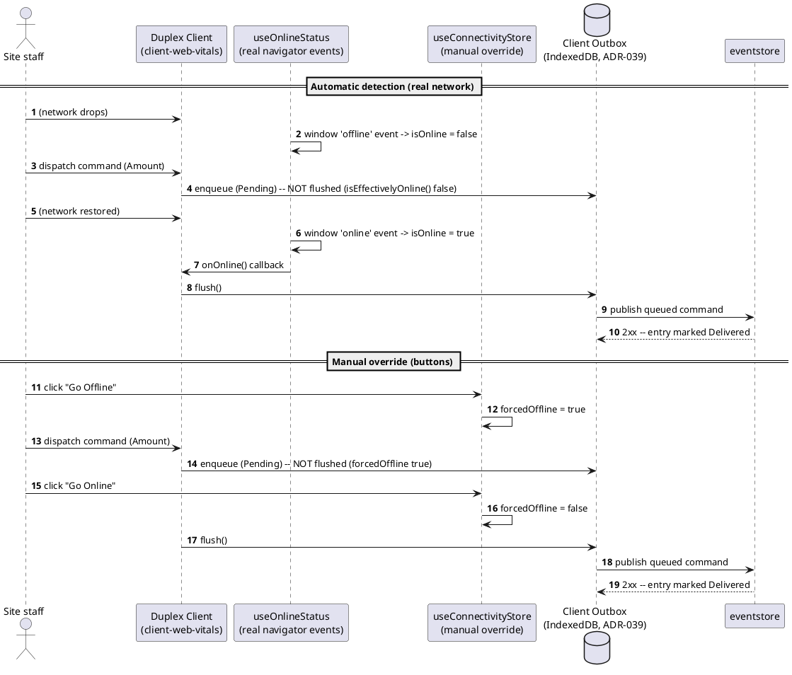
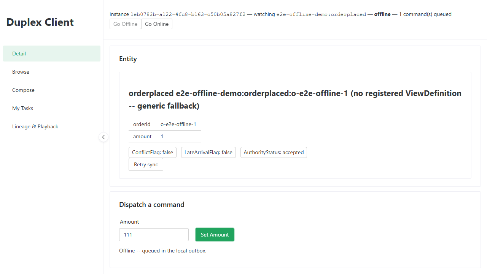
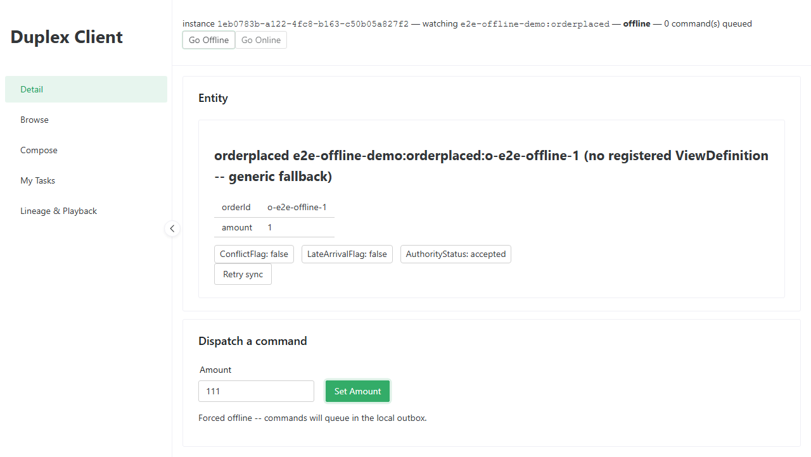

# Core -- Go Offline and Resync (Automatic Detection + Manual Override)

_Generated by `EventStore.E2ETests` against a real running deployment -- re-run `dotnet test tests/EventStore.E2ETests` to regenerate. Don't hand-edit this file directly; edit the owning test's own step captions instead, or the content will be overwritten on the next run._

## Sequence Diagram

## Step 1. Opening the Duplex Client, pointed (via query-string overrides, appConfig.ts's own documented mechanism) at this playbook's own throwaway demo entity. The header shows the real, automatically-detected connectivity state -- online -- and the seed order this test published is already loaded into the "Dispatch a command" panel below.

## Step 2. Automatic detection: Playwright drops the real network (BrowserContext.SetOfflineAsync), which flips the browser's own navigator.onLine and fires a real 'offline' event -- useOnlineStatus's existing listener (no new code) reacts, and the header switches to "offline" with no manual action taken.

## Step 3. Dispatching a command while genuinely offline: the command is durably enqueued in the client's local outbox (IndexedDB, ADR-039) rather than lost or blocked -- the status message confirms it queued instead of dispatching.

## Step 4. Restoring the real network: the browser's own 'online' event fires automatically, useOnlineStatus's listener flushes the outbox with no user action, and the header's queued-command count returns to 0 -- the automatic reconnect-and-sync cycle, proven against a genuine network transition.

## Step 5. Manual override: clicking the new "Go Offline" button (useConnectivityStore, added this pass) forces the app into the offline path even though the real network is still up -- for a deterministic demo/test, independent of actual connectivity.

## Step 6. A command dispatched while manually forced offline queues exactly the same way a real-network drop does -- both paths converge on the one durable outbox, useEntityViewActions never distinguishes why it's offline.

## Step 7. Clicking "Go Online" clears the manual override and immediately flushes the outbox -- both the manually-queued and (from Part 1) any still-pending command are delivered, confirmed by the queued-command count returning to 0.

