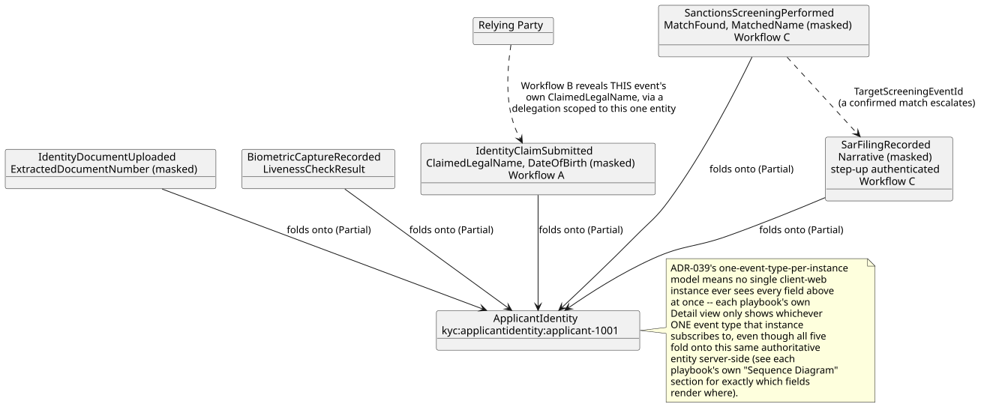
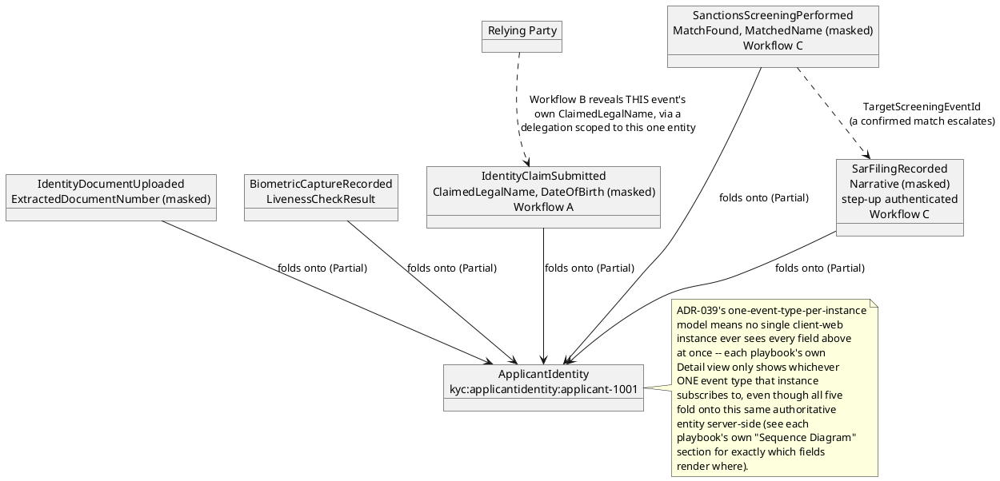

[← UI Playbooks](../README.md)

# Meridian — Workflows and How They Interact

Meridian (the digital-identity/KYC proving ground, `docs/domains/
digital-identity-kyc/`) is the second of the two "applications" this
design package builds out to reference-app depth. Like `vitals/
README.md`, this file is specific to Meridian: its own workflows, the
playbooks demonstrating each, and how those workflows actually connect
through the same continuity applicant.

This file is hand-written, not generated (unlike every playbook it
links to).

## Workflows

Meridian has three workflows (`docs/domains/digital-identity-kyc/
README.md`'s own `## Workflows` section); every one now has at least
one real UI playbook.

| Workflow | What it covers | Playbooks |
|---|---|---|
| A — Document/Biometric Capture → Verification | An applicant uploads documents and a biometric, then self-attests a DID identity claim | [Capture Identity Documents](applicant/capture-identity-documents.md), [Review Identity Claim](kyc-analyst/review-identity-claim.md) |
| B — Relying-Party Access | A customer delegates a capped, time-boxed grant; a relying party reveals exactly the field named | [Request Delegated Access](relying-party/request-delegated-access.md) |
| C — Ongoing Screening & SAR Escalation | Periodic re-screening flags a match; a compliance officer decides it and, if confirmed, files a SAR | [Review Periodic Screening](compliance-officer/review-periodic-screening.md), [Decide a Pending Match](compliance-officer/decide-pending-match.md), [File SAR](compliance-officer/file-sar.md) |

## How the workflows interact

All three workflows operate on the same continuity applicant,
`applicant-1001` (`Samples.Meridian.Seed`) — and unlike Vitals' own
"same subject, several loosely-related entities" shape, Meridian's
three workflows fold onto **the exact same entity**,
`kyc:applicantidentity:applicant-1001`, every time. Workflow B doesn't
just happen to reference the same applicant Workflow A created — it
reveals a field Workflow A's own event actually carries, and can only
do so because Workflow A's data exists first.

**Workflow B is a real dependency on Workflow A, not just a shared
subject**: `docs/playbooks/relying-party/request-delegated-access.md`
reveals `IdentityClaimSubmitted`'s own `ClaimedLegalName` — the exact
event `capture-identity-documents.md`/`review-identity-claim.md`
already walk through creating. Workflow C is independent of A/B at the
schema level (`SanctionsScreeningPerformed`/`SarFilingRecorded` declare
no `RequiredClaims`/`ParentValidationMode` tie to `IdentityClaimSubmitted`),
but in practice never runs against an applicant who hasn't already
gone through Workflow A — screening an identity that was never
verified isn't a real KYC sequence.

**The masking pattern repeats across all three workflows, not
coincidentally**: `ClaimedLegalName`/`DateOfBirth` (Workflow A),
`MatchedName`/`MatchedListEntryId` (Workflow C's screening),
`Narrative` (Workflow C's SAR) are all `x-masking`'d PII/investigation
data, each gated behind its own claim (`identity:pii-read` vs.
`identity:aml-review`) — Workflow B's own delegation mechanism is what
lets a caller holding neither claim directly still reveal ONE named
field for ONE named entity, time-boxed, without ever widening who
holds the underlying claim itself.
