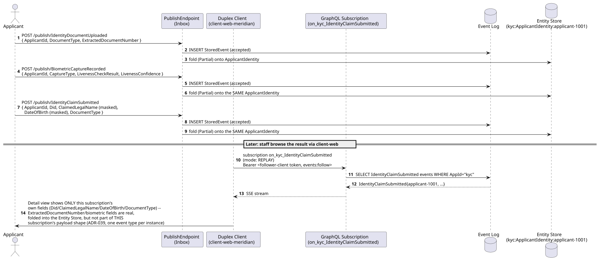
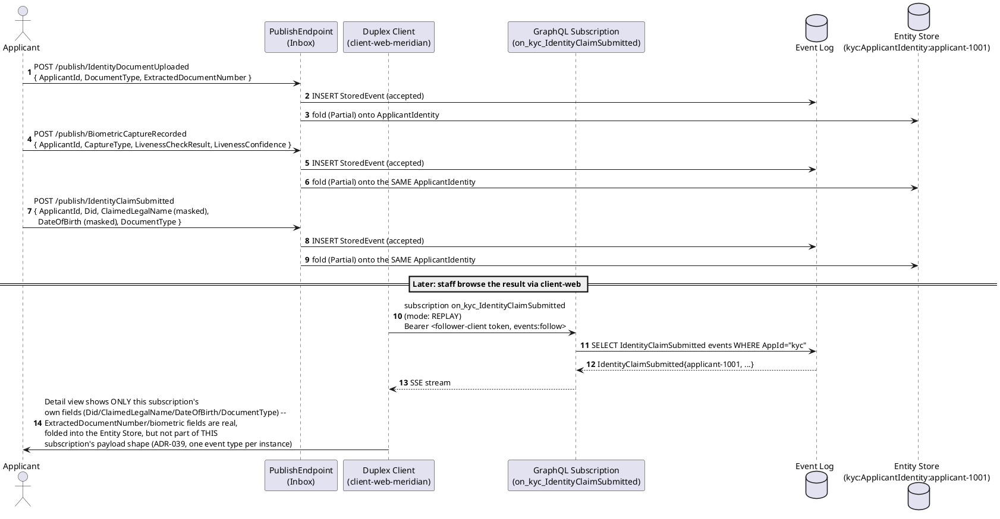
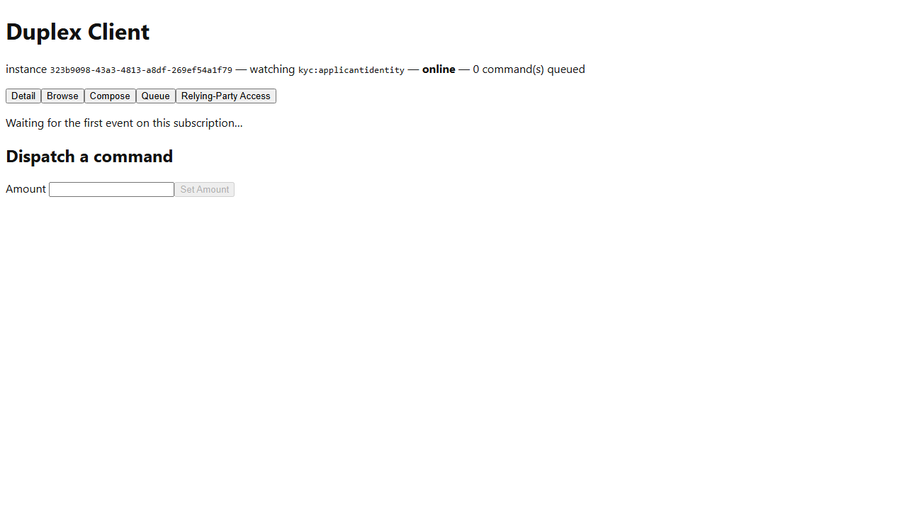

# Meridian -- Workflow A: Document and Biometric Capture

_Generated by `EventStore.E2ETests` against a real running deployment -- re-run `dotnet test tests/EventStore.E2ETests` to regenerate. Don't hand-edit this file directly; edit the owning test's own step captions instead, or the content will be overwritten on the next run._

## Sequence Diagram

## Step 1. Opening the Meridian instance of the Duplex Client. It's launch-configured (ADR-039) to subscribe to the kyc IdentityClaimSubmitted event type.

## Step 2. Switching to the Browse tab. The continuity applicant applicant-1001 (Samples.Meridian.Seed) is already present, having published IdentityDocumentUploaded, BiometricCaptureRecorded, and IdentityClaimSubmitted -- all folded onto the one kyc:ApplicantIdentity:applicant-1001 entity.

## Step 3. Selecting applicant-1001 opens its Detail view, rendered from the ApplicantIdentity Detail ViewDefinition Samples.Meridian.Seed registers (ADR-039). This subscription's own payload type is IdentityClaimSubmitted's, so only that event's fields (DID, claimed legal name, date of birth, document type) render -- ExtractedDocumentNumber/biometric fields from the upstream capture events aren't part of this payload shape, even though all three events fold onto the same entity in the Entity Store itself.

