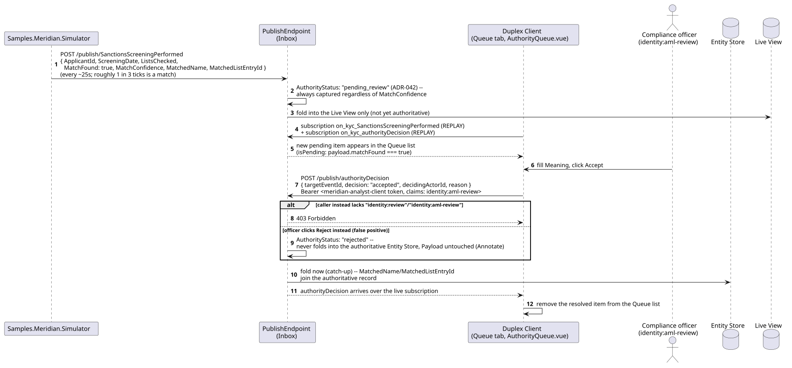
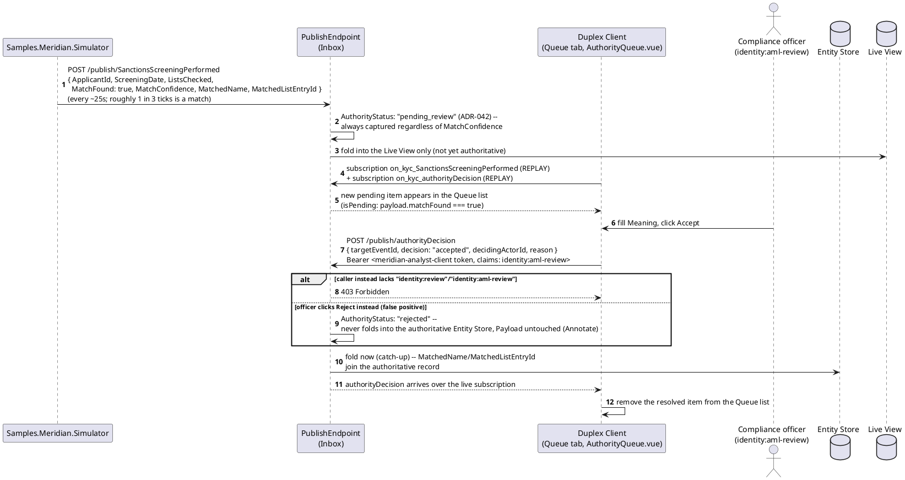
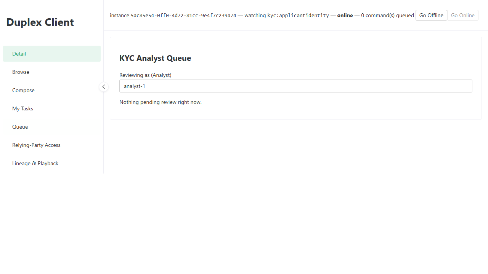
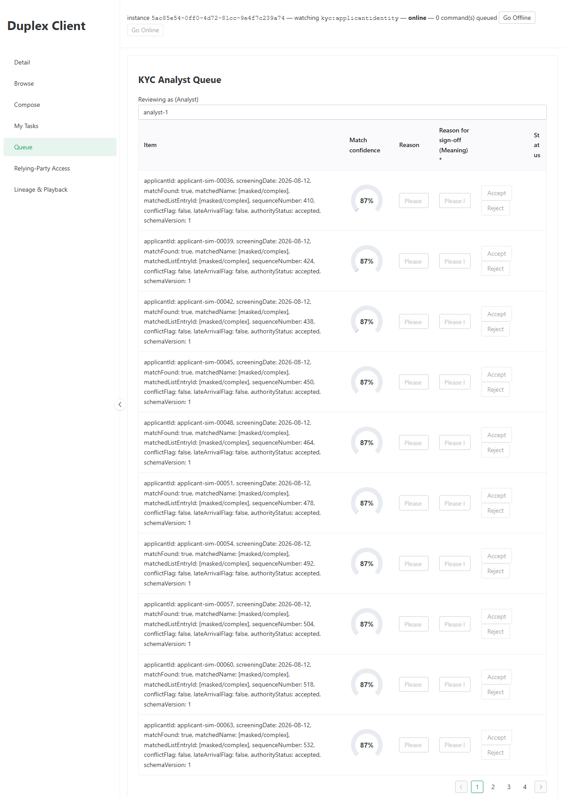

# Meridian -- KYC Analyst Queue: Decide a Pending Sanctions Match

_Generated by `EventStore.E2ETests` against a real running deployment -- re-run `dotnet test tests/EventStore.E2ETests` to regenerate. Don't hand-edit this file directly; edit the owning test's own step captions instead, or the content will be overwritten on the next run._

## Sequence Diagram

## Step 1. Opening the KYC Analyst Queue tab -- a real, already-built screen (MeridianAnalystQueue.vue) reachable from any Meridian client instance, not new this pass.

## Step 2. Samples.Meridian.Simulator publishes a fresh SanctionsScreeningPerformed for a new applicant roughly every 25 seconds, alternating MatchFound so the queue shows both hits and clears -- this is a real, live pending match, not fixed seed data.

## Step 3. Filling in the required sign-off reason (Meaning, ADR-066) and clicking Accept publishes an authorityDecision as meridian-analyst-client (claims: identity:aml-review) -- AuthorityDecisionResolver folds the confirmed match into the authoritative Entity Store, and the item disappears from this queue the moment that decision arrives back over the same live subscription.

