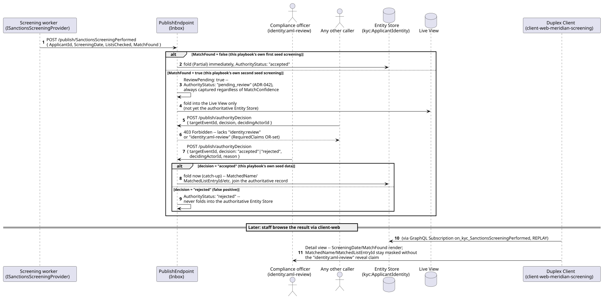
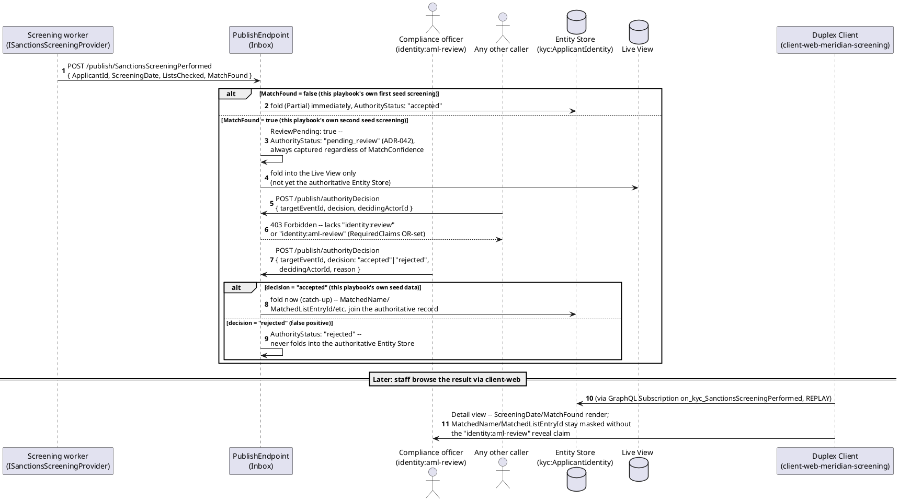
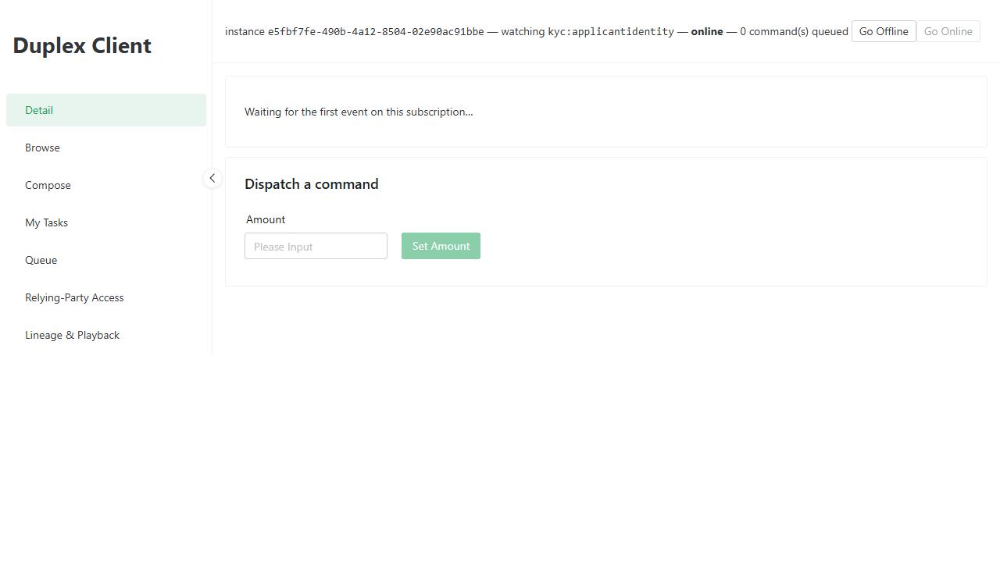
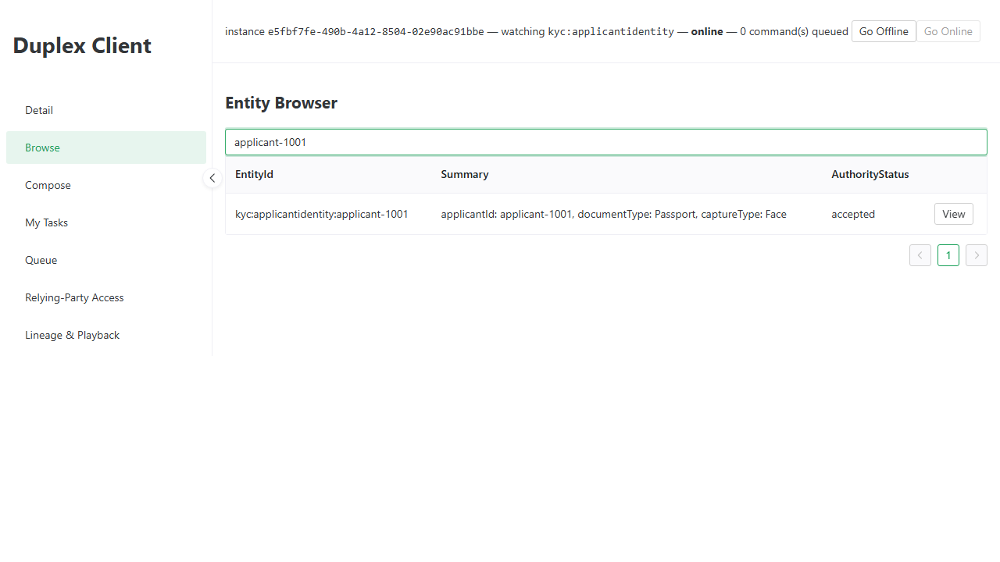

# Meridian -- Workflow C: Periodic Screening and SAR Escalation (screening half only)

_Generated by `EventStore.E2ETests` against a real running deployment -- re-run `dotnet test tests/EventStore.E2ETests` to regenerate. Don't hand-edit this file directly; edit the owning test's own step captions instead, or the content will be overwritten on the next run._

## Sequence Diagram

## Step 1. Opening the Meridian-Screening instance of the Duplex Client -- a dedicated client-web instance launch-configured (ADR-039) to subscribe to the kyc SanctionsScreeningPerformed event type.

## Step 2. Switching to the Browse tab. The seed continuity applicant applicant-1001's periodic sanctions screening (Samples.Meridian.Seed) is already present via REPLAY-mode catch-up.

## Step 3. Selecting applicant-1001 opens its Detail view. The registered ApplicantIdentity template now covers this event type's own fields too -- Screening Date (2026-07-30, the later, matched screening -- this instance's entity cache reflects the most recent SanctionsScreeningPerformed for this applicant) and Match Found (true). Lists Checked renders blank -- EventTypeSchemaReader.cs deliberately skips top-level array-typed properties when building this GraphQL payload type at all (an already-documented, accepted narrowing, not a new gap), so ListsChecked was never selectable to begin with. Document Type/Claimed Legal Name/Date of Birth/DID stay blank here, same reasoning as before: those are IdentityClaimSubmitted's own fields, not this subscription's.

![Selecting applicant-1001 opens its Detail view. The registered ApplicantIdentity template now covers this event type's own fields too -- Screening Date (2026-07-30, the later, matched screening -- this instance's entity cache reflects the most recent SanctionsScreeningPerformed for this applicant) and Match Found (true). Lists Checked renders blank -- EventTypeSchemaReader.cs deliberately skips top-level array-typed properties when building this GraphQL payload type at all (an already-documented, accepted narrowing, not a new gap), so ListsChecked was never selectable to begin with. Document Type/Claimed Legal Name/Date of Birth/DID stay blank here, same reasoning as before: those are IdentityClaimSubmitted's own fields, not this subscription's.](review-periodic-screening/step-03.png)

