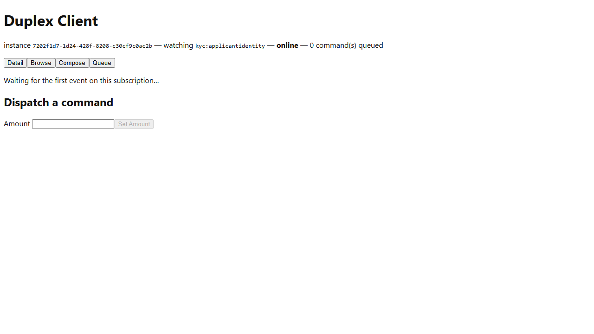
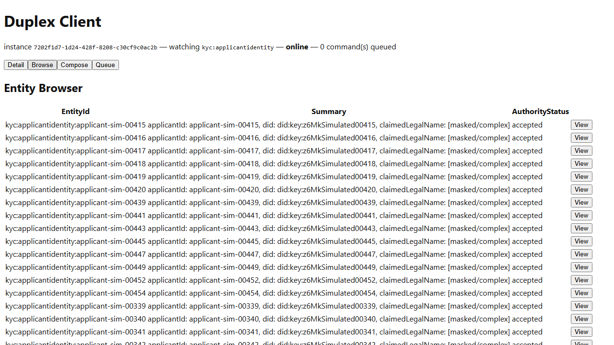

# Meridian -- Workflow A: Customer Onboarding and Identity Verification

_Generated by `EventStore.E2ETests` against a real running deployment -- re-run `dotnet test tests/EventStore.E2ETests` to regenerate. Don't hand-edit this file directly; edit the owning test's own step captions instead, or the content will be overwritten on the next run._

## Step 1. Opening the Meridian instance of the Duplex Client, launch-configured (ADR-039) to subscribe to the kyc IdentityClaimSubmitted event type -- the self-attested DID/UCAN claim this workflow's downstream review acts on.

## Step 2. The Browse tab shows applicant-1001, whose IdentityClaimSubmitted event carries its self-attested did:key DID alongside the claimed legal name and date of birth (ADR-036).

## Step 3. The Detail view -- rendered generically via GenericFallbackView; the registered ApplicantIdentity ViewDefinition doesn't resolve at runtime here (a real, unexplained gap -- TODO.md) -- shows the IdentityClaimSubmitted payload itself (masked ClaimedLegalName/DateOfBirth, ADR-009) plus AuthorityStatus: accepted, this workflow's own end state: an analyst's review (ADR-035/ADR-042/ADR-046) has accepted the self-attested claim into the record.

