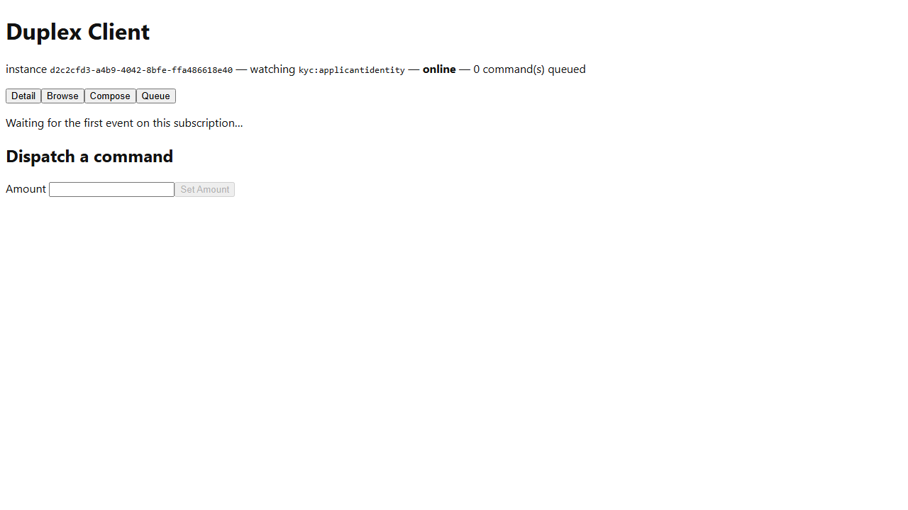

# Meridian -- Workflow A: Document and Biometric Capture

_Generated by `EventStore.E2ETests` against a real running deployment -- re-run `dotnet test tests/EventStore.E2ETests` to regenerate. Don't hand-edit this file directly; edit the owning test's own step captions instead, or the content will be overwritten on the next run._

## Step 1. Opening the Meridian instance of the Duplex Client. It's launch-configured (ADR-039) to subscribe to the kyc IdentityClaimSubmitted event type.

## Step 2. Switching to the Browse tab. The continuity applicant applicant-1001 (Samples.Meridian.Seed) is already present, having published IdentityDocumentUploaded, BiometricCaptureRecorded, and IdentityClaimSubmitted -- all folded onto the one kyc:ApplicantIdentity:applicant-1001 entity.

## Step 3. Selecting applicant-1001 opens its Detail view -- rendered generically, via GenericFallbackView (ADR-039); the registered ApplicantIdentity ViewDefinition doesn't resolve at runtime here (a real, unexplained gap -- TODO.md), matching the same symptom already seen for Vitals' Patient. This subscription's own payload type is IdentityClaimSubmitted's, so only that event's fields (DID, claimed legal name, date of birth, document type) render -- ExtractedDocumentNumber/biometric fields from the upstream capture events aren't part of this payload shape, even though all three events fold onto the same entity in the Entity Store itself.

![Selecting applicant-1001 opens its Detail view -- rendered generically, via GenericFallbackView (ADR-039); the registered ApplicantIdentity ViewDefinition doesn't resolve at runtime here (a real, unexplained gap -- TODO.md), matching the same symptom already seen for Vitals' Patient. This subscription's own payload type is IdentityClaimSubmitted's, so only that event's fields (DID, claimed legal name, date of birth, document type) render -- ExtractedDocumentNumber/biometric fields from the upstream capture events aren't part of this payload shape, even though all three events fold onto the same entity in the Entity Store itself.](workflow-a-document-and-biometric-capture/step-03.png)

