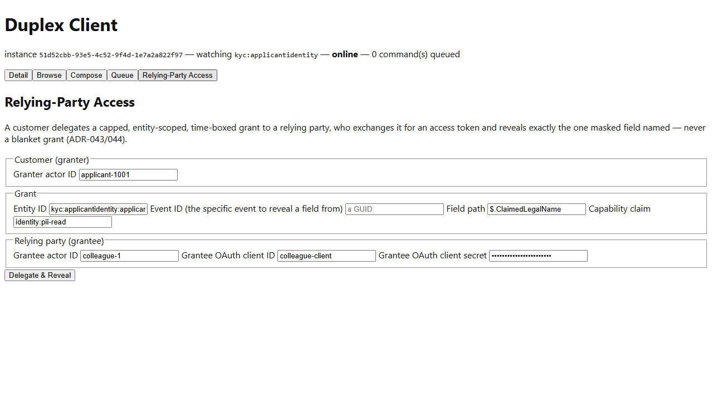

# Meridian -- Workflow B: Relying-Party Access

_Generated by `EventStore.E2ETests` against a real running deployment -- re-run `dotnet test tests/EventStore.E2ETests` to regenerate. Don't hand-edit this file directly; edit the owning test's own step captions instead, or the content will be overwritten on the next run._

## Step 1. Opening the Relying-Party Access tab -- new this pass, Meridian-only (ADR-043/044). A raw form, not a guided wizard: it demonstrates the underlying delegation mechanism directly, the same posture the Event Composer tab already takes toward publishing.

## Step 2. Filling in the grant: Entity ID and Field Path default to the continuity applicant applicant-1001's ClaimedLegalName; Event ID names the specific IdentityClaimSubmitted event to reveal it from (Samples.Meridian.Seed's own fixed EventId). The Capability claim (identity:pii-read) is exactly what ClaimedLegalName's own x-masking.requiredClaim names.

## Step 3. Clicking "Delegate & Reveal" runs the whole mechanism live in the browser: a freshly-generated customer DID key (WebCrypto ECDSA P-256) is registered as an AppTrustRoot, signs a UCAN delegation naming exactly this one field for exactly this one entity, exchanges it for a scoped access token (RFC 8693), then reveals the field with it. "John Doe" -- the real seed value -- comes back, proving the whole chain actually worked, not a stubbed response.

