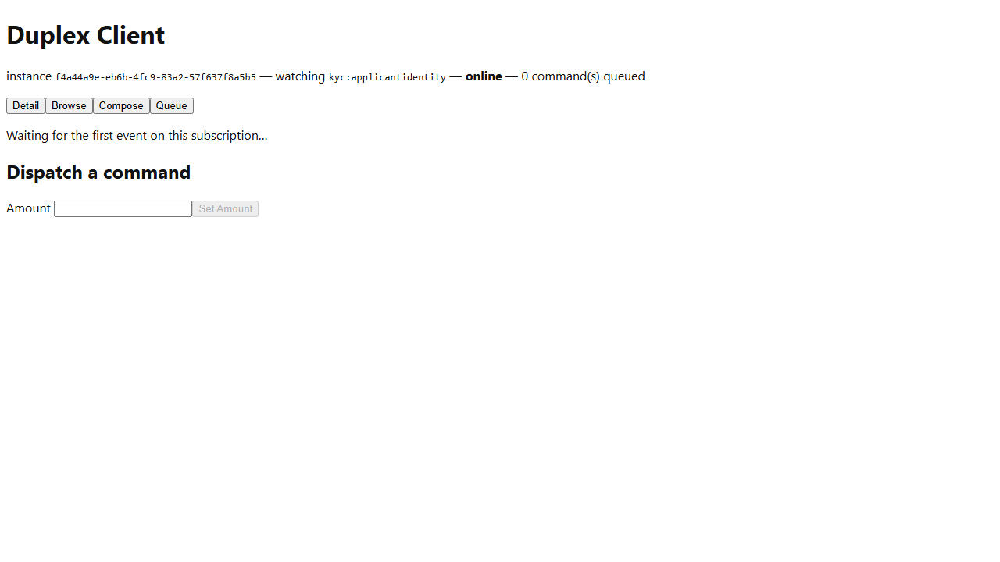
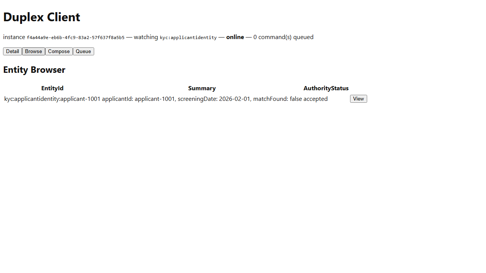

# Meridian -- Workflow C: Periodic Screening and SAR Escalation (screening half only)

_Generated by `EventStore.E2ETests` against a real running deployment -- re-run `dotnet test tests/EventStore.E2ETests` to regenerate. Don't hand-edit this file directly; edit the owning test's own step captions instead, or the content will be overwritten on the next run._

## Step 1. Opening the Meridian-Screening instance of the Duplex Client -- a dedicated client-web instance launch-configured (ADR-039) to subscribe to the kyc SanctionsScreeningPerformed event type.

## Step 2. Switching to the Browse tab. The seed continuity applicant applicant-1001's periodic sanctions screening (Samples.Meridian.Seed) is already present via REPLAY-mode catch-up.

## Step 3. Selecting applicant-1001 opens its Detail view. The registered ApplicantIdentity template renders here too, but its own bound fields (applicantId, documentType, claimedLegalName, dateOfBirth, did) don't match this subscription's SanctionsScreeningPerformed payload shape at all -- every field but applicantId renders blank. ScreeningDate/ListsChecked/MatchFound are real, published data (Samples.Meridian.Seed), just not reachable through this particular template -- a genuine ViewDefinition/payload-shape mismatch, not a masking or subscription defect.

![Selecting applicant-1001 opens its Detail view. The registered ApplicantIdentity template renders here too, but its own bound fields (applicantId, documentType, claimedLegalName, dateOfBirth, did) don't match this subscription's SanctionsScreeningPerformed payload shape at all -- every field but applicantId renders blank. ScreeningDate/ListsChecked/MatchFound are real, published data (Samples.Meridian.Seed), just not reachable through this particular template -- a genuine ViewDefinition/payload-shape mismatch, not a masking or subscription defect.](workflow-c-periodic-screening-and-sar-escalation/step-03.png)

