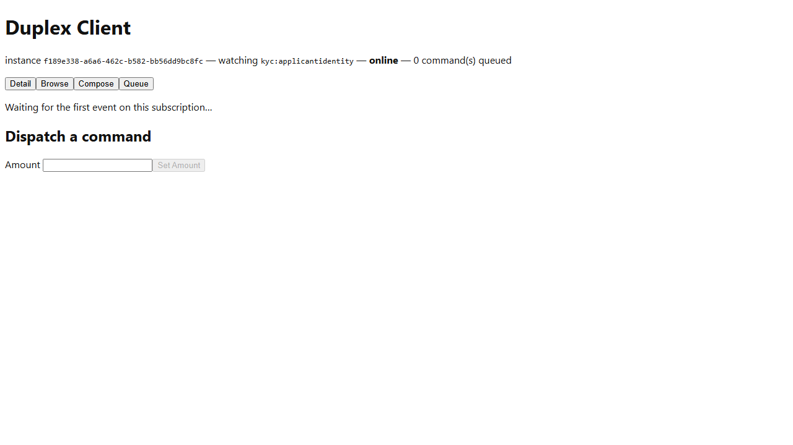

# Meridian -- Workflow C: SAR Filing

_Generated by `EventStore.E2ETests` against a real running deployment -- re-run `dotnet test tests/EventStore.E2ETests` to regenerate. Don't hand-edit this file directly; edit the owning test's own step captions instead, or the content will be overwritten on the next run._

## Step 1. Opening the Meridian-SarFiling instance of the Duplex Client -- a dedicated client-web instance launch-configured (ADR-039) to subscribe to the kyc SarFilingRecorded event type.

## Step 2. Switching to the Browse tab. The seed's SAR filing for applicant-1001 (Samples.Meridian.Seed) is already present via REPLAY-mode catch-up -- a compliance officer's step-up-authenticated publish, gated by MeridianWorkflowC.cs's RequiredSignature: ["urn:kyc:acr:step-up"] (RFC 9470, ADR-066).

![Switching to the Browse tab. The seed's SAR filing for applicant-1001 (Samples.Meridian.Seed) is already present via REPLAY-mode catch-up -- a compliance officer's step-up-authenticated publish, gated by MeridianWorkflowC.cs's RequiredSignature: ["urn:kyc:acr:step-up"] (RFC 9470, ADR-066).](workflow-c-sar-filing/step-02.png)

## Step 3. Selecting applicant-1001 opens its Detail view. The registered ApplicantIdentity template now covers this event type's own fields too (TODO.md's ViewDefinition/payload-shape mismatch, fixed by extending the one shared template): Filing Reference ID (SAR-2026-00417) renders plainly, and Narrative renders masked ("***") -- a live demonstration of x-masking on this specific field (MeridianWorkflowC.cs's own requiredClaim: identity:aml-review), not a rendering gap.

