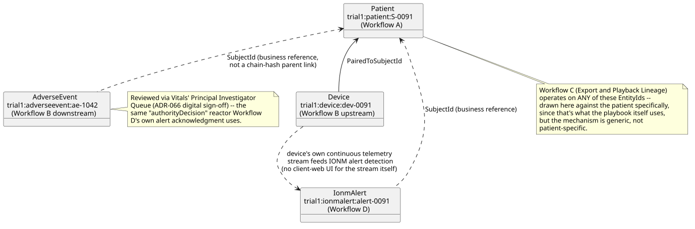
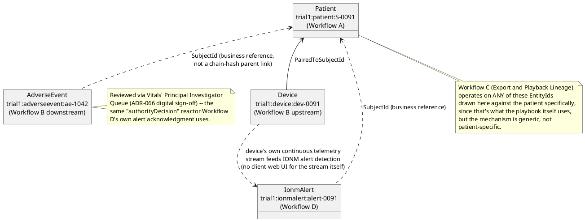

[← UI Playbooks](../README.md)

# Vitals — Workflows and How They Interact

Vitals (the clinical-trials/connected-medical-device-telemetry proving
ground, `docs/domains/clinical-trials-device-telemetry/`) is one of the
two "applications" this design package builds out to reference-app
depth. Unlike `docs/playbooks/README.md`'s own top-level catalog (a
flat table across both domains), this file is specific to Vitals: its
own workflows, the playbooks demonstrating each, and — the part a flat
catalog table can't show — how those workflows actually connect to one
another through the same continuity data.

This file is hand-written, not generated (unlike every playbook it
links to) — it's an index and an explanation, not a screenshot
walkthrough.

## Workflows

Vitals has four workflows (`docs/domains/clinical-trials-device-
telemetry/README.md`'s own `## Workflows` section); every one now has
at least one real UI playbook.

| Workflow | What it covers | Playbooks |
|---|---|---|
| A — Enrollment & Consent | A patient is screened and consents, becoming an active study participant | [Enroll and Review Patient](site-coordinator/enroll-and-review-patient.md) |
| B — Device Monitoring → Adverse Event Review | A device is paired to the patient; a detector escalates a finding into adverse-event review | [Onboard Monitoring Device](site-coordinator/onboard-monitoring-device.md), [Capture and Review Adverse Event](site-coordinator/capture-and-review-adverse-event.md) |
| C — Trial Data Export & Subject Rights | A sponsor/regulator exports a subject's lineage and plays it back as of a past SequenceNumber | [Export and Playback Lineage](sponsor-auditor/export-and-playback-lineage.md) |
| D — Intraoperative Monitoring & Alert Response | A real-time IONM alert is raised and must be acknowledged within a deadline | [Monitor and Respond to Alert](neurotechnologist/monitor-and-respond-to-alert.md), [Decide a Pending IONM Alert](principal-investigator/decide-pending-alert.md) |

## How the workflows interact

All four workflows share the same continuity subject, `S-0091`
(`Samples.Vitals.Seed`) — this isn't incidental: it's what makes the
diagram below a real dependency graph, not four disconnected examples.
Workflow A creates the patient every other workflow refers back to;
Workflow B's device is paired to that same patient and is the thing
Workflow D's IONM stream actually comes from; Workflow C can export or
play back any of it, since lineage export operates on whatever
`EntityId` you give it, not a workflow-specific mechanism.

**What's real vs. what's business convention, worth being precise
about**: `Device`→`Patient` (`PairedToSubjectId`) and the adverse
event/alert→`Patient` (`SubjectId`) links are **payload fields**, not
`ADR-005` causal parent links (`parentEventIds`) — nothing in the Event
Log itself enforces that an `AdverseEventReported` naming a given
`SubjectId` actually corresponds to a patient that was ever screened.
This mirrors real clinical-trial practice (a `SubjectId` is a business
identifier looked up by a human, not database-referentially-enforced)
and is deliberate, not an oversight — see
`docs/domains/clinical-trials-device-telemetry/README.md`'s own
`ADR-005` "secondary fit" note.

**The Principal Investigator Queue is the one place Workflow B and D
genuinely share a mechanism, not just a subject** — but precisely: the
Queue's own Accept/Reject publishes an `authorityDecision`
(`VitalsSharedTypes.EnsureAuthorityDecisionRegisteredAsync`) targeting
the raiser event directly, registered with a different `RequiredClaims`
per domain (`review:ae` for the adverse event, `review:ionm` for the
IONM alert) — one generic mechanism, two real personas. This is
distinct from the neurologist's own `IonmAlertAcknowledged`
(`Monitor and Respond to Alert`'s own playbook) — an immediate,
claim-free operational acknowledgment, not a formal decision — and from
the domain's own further-described "attending neurologist's later,
signed interpretation," which reuses this same `authorityDecision`
mechanism a third time but isn't demonstrated by either playbook here.
