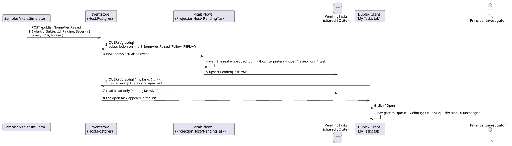
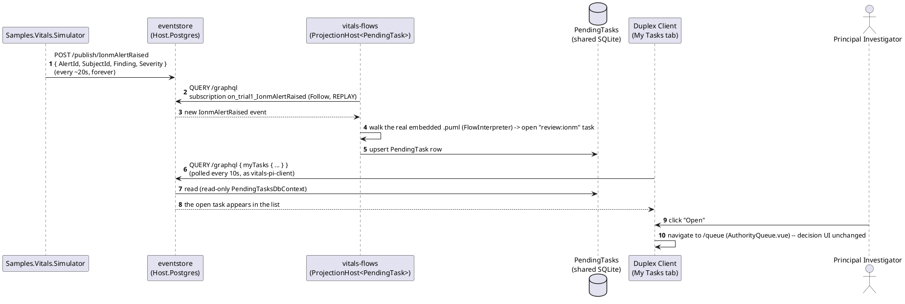
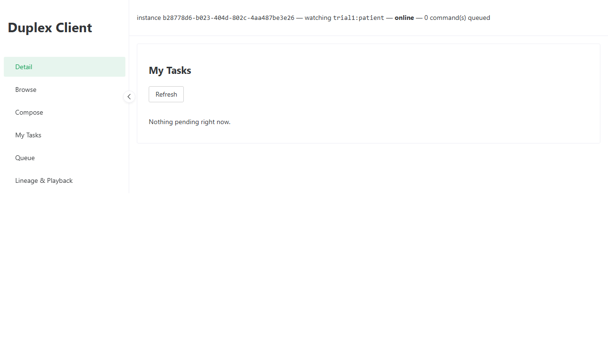
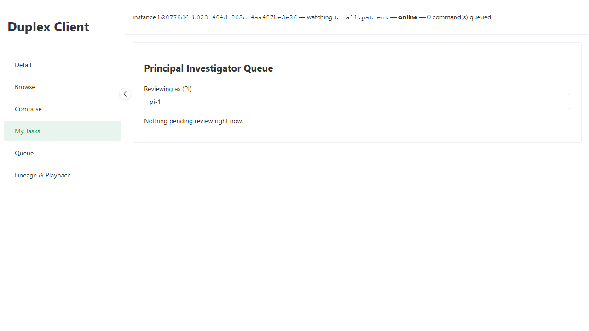

# Vitals -- My Tasks: Discover and Open a Pending Task

_Generated by `EventStore.E2ETests` against a real running deployment -- re-run `dotnet test tests/EventStore.E2ETests` to regenerate. Don't hand-edit this file directly; edit the owning test's own step captions instead, or the content will be overwritten on the next run._

## Sequence Diagram

## Step 1. Opening the My Tasks tab -- one cross-domain list (ADR-101), reachable from any client-web instance regardless of AppId, backed by the myTasks GraphQL query over the flow engine's own PendingTask read model.

## Step 2. Samples.Vitals.Simulator publishes a fresh IonmAlertRaised roughly every 20 seconds -- vitals-flows (a real AppHost worker resource, ADR-101) walks the real embedded intraoperative-monitoring-and-alert-response.puml against it and raises an open 'review:ionm' task the moment it arrives, polled into view here within a few seconds.

## Step 3. "Open" navigates to the existing Principal Investigator Queue screen (AuthorityQueue.vue) -- the task list only discovers work, the accept/reject decision UI is unchanged (ADR-101's own Consequences).

