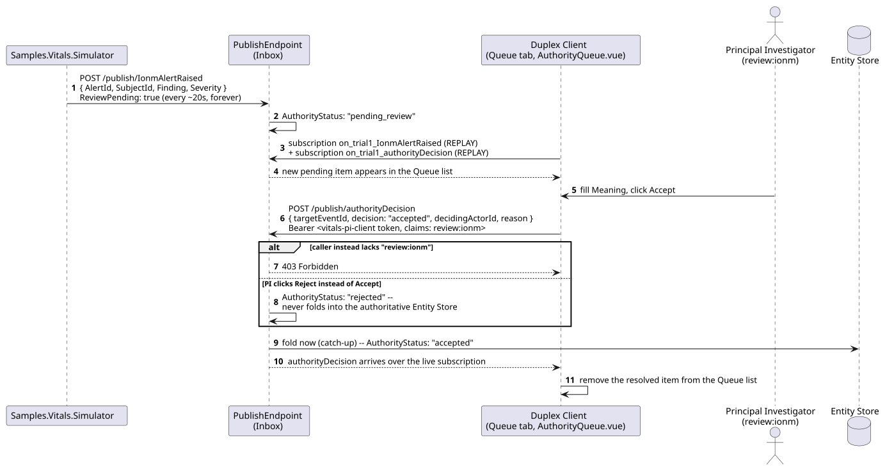
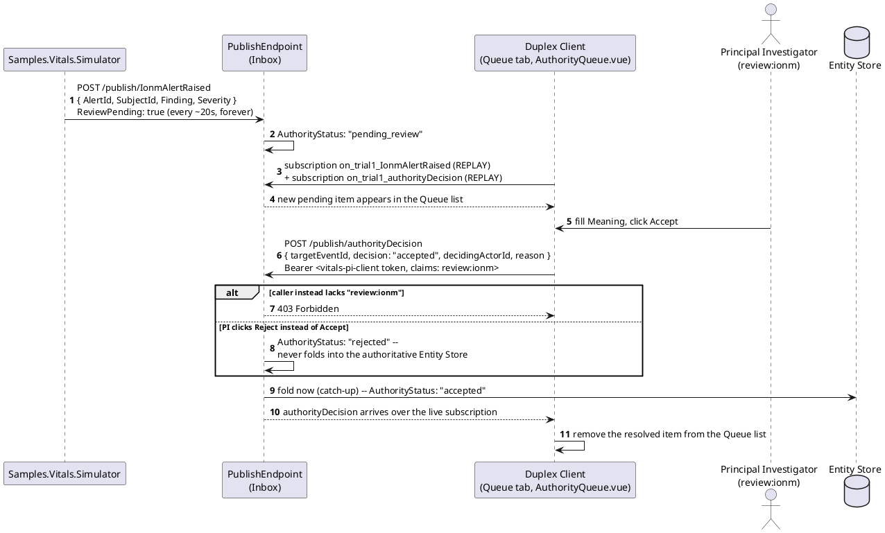
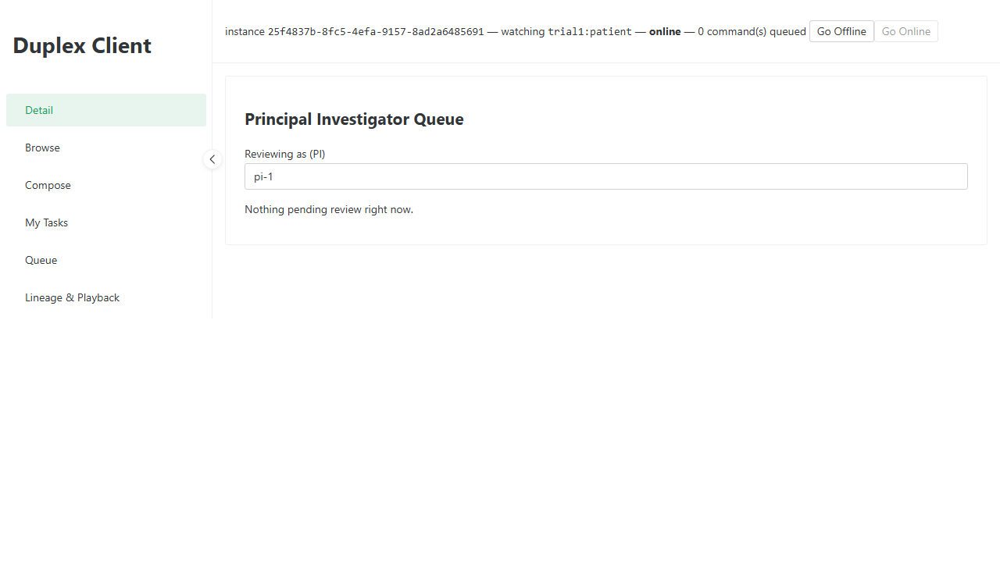

# Vitals -- Principal Investigator Queue: Decide a Pending IONM Alert

_Generated by `EventStore.E2ETests` against a real running deployment -- re-run `dotnet test tests/EventStore.E2ETests` to regenerate. Don't hand-edit this file directly; edit the owning test's own step captions instead, or the content will be overwritten on the next run._

## Sequence Diagram

## Step 1. Opening the Principal Investigator Queue tab -- a real, already-built screen (VitalsPiQueue.vue) reachable from any Vitals client instance, not new this pass.

## Step 2. Samples.Vitals.Simulator publishes a fresh IonmAlertRaised with ReviewPending: true roughly every 20 seconds -- this is a real, live pending item, not fixed seed data. The queue subscribes to both the raiser event type and authorityDecision live, so a decision anywhere resolves this list immediately.

## Step 3. Filling in the required sign-off reason (Meaning, ADR-066) and clicking Accept publishes an authorityDecision as vitals-pi-client (claims: review:ionm) -- AuthorityDecisionResolver folds the target IonmAlertRaised into the authoritative Entity Store, and the item disappears from this queue the moment that decision arrives back over the same live subscription.

