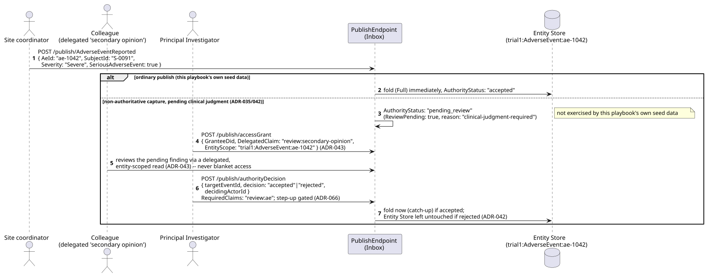
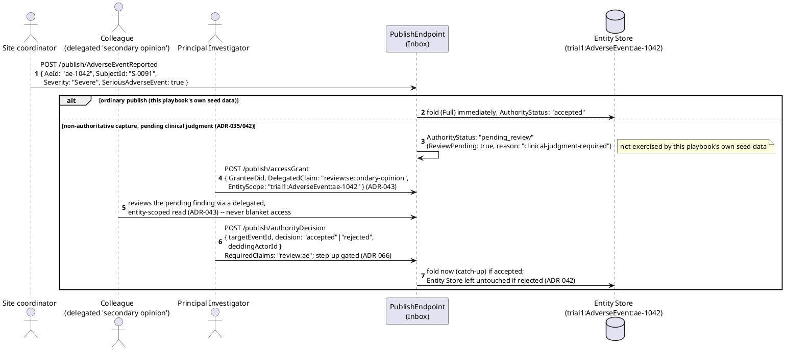
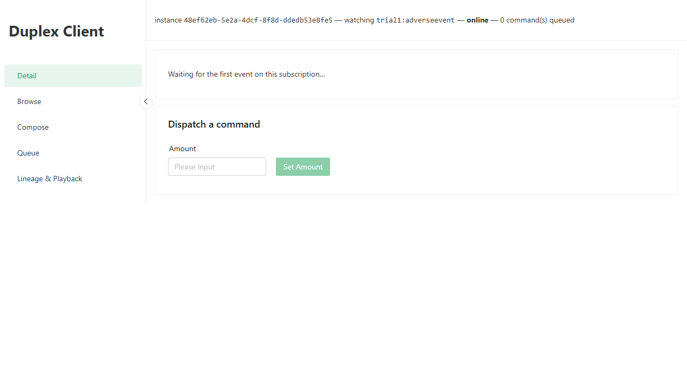
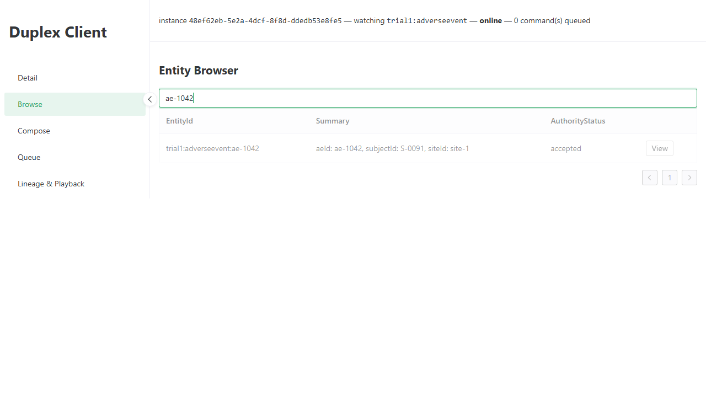

# Vitals -- Workflow B: Adverse Event Capture and Review

_Generated by `EventStore.E2ETests` against a real running deployment -- re-run `dotnet test tests/EventStore.E2ETests` to regenerate. Don't hand-edit this file directly; edit the owning test's own step captions instead, or the content will be overwritten on the next run._

## Sequence Diagram

## Step 1. Opening the Vitals-AdverseEvent instance of the Duplex Client -- a dedicated client-web instance launch-configured (ADR-039) to subscribe to the trial1 AdverseEventReported event type.

## Step 2. Switching to the Browse tab. The seed continuity adverse event ae-1042 (Samples.Vitals.Seed) -- the same AeId the feature doc's own worked example uses -- is already present via REPLAY-mode catch-up.

## Step 3. Selecting ae-1042 opens its Detail view -- rendered generically via GenericFallbackView (ADR-039), since no ViewDefinition is registered for the "adverseevent" EntityType. Shows the reported severity (Severe) and SeriousAdverseEvent flag (true) -- this playbook stops at capture; the delegated secondary-opinion review and investigator sign-off this workflow's own feature doc describes (ADR-043/ADR-066) have no dedicated client-web screen yet, only the same generic property view every entity gets.

