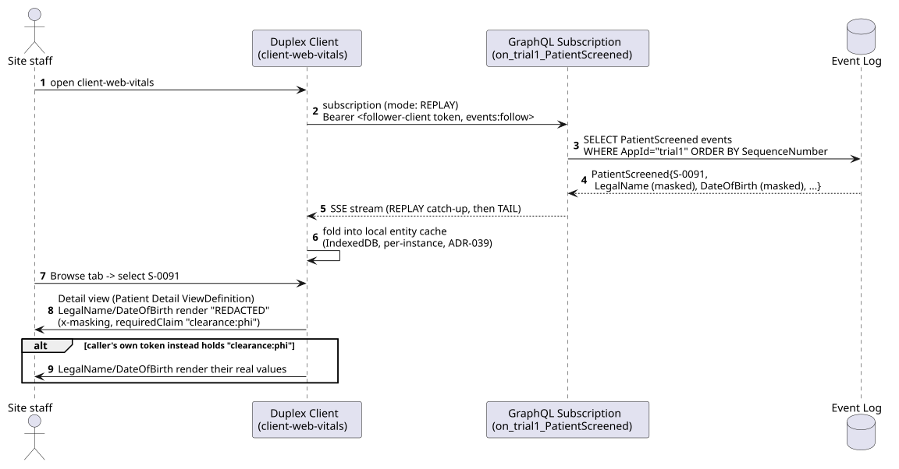
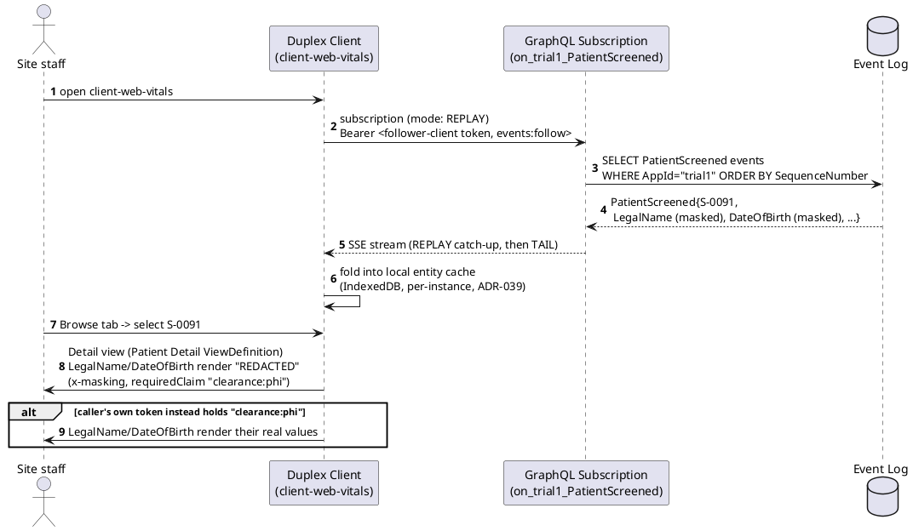
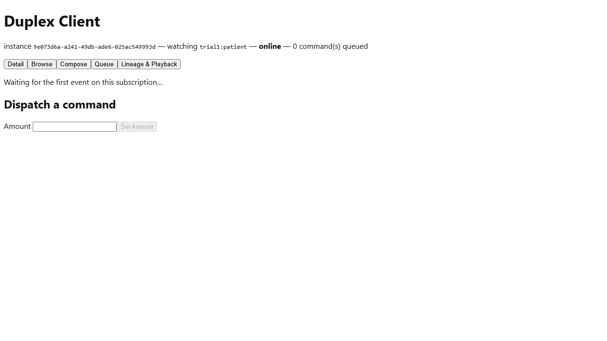
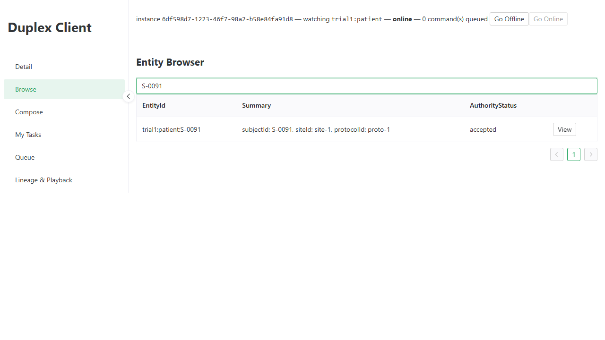

# Vitals -- Workflow A: Patient Enrollment and Informed Consent

_Generated by `EventStore.E2ETests` against a real running deployment -- re-run `dotnet test tests/EventStore.E2ETests` to regenerate. Don't hand-edit this file directly; edit the owning test's own step captions instead, or the content will be overwritten on the next run._

## Sequence Diagram

## Step 1. Opening the Vitals instance of the Duplex Client. It's already subscribed to the trial1 PatientScreened event type (ADR-039's own per-instance launch configuration).

## Step 2. Switching to the Browse tab. The continuity subject S-0091 (Samples.Vitals.Seed) is already present -- REPLAY mode (not TAIL) means the full historical PatientScreened stream is caught up on first subscribe, not just new arrivals.

## Step 3. Selecting S-0091 from the browser opens its Detail view, rendered from the Patient Detail ViewDefinition Samples.Vitals.Seed registers (ADR-039) -- subject/site/protocol IDs, eligibility status, and the masked legal name/date of birth fields (translated via translations.ts's placeholderTranslations, ADR-087).

