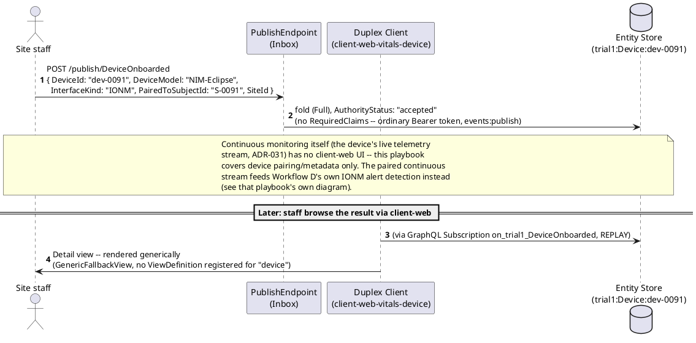
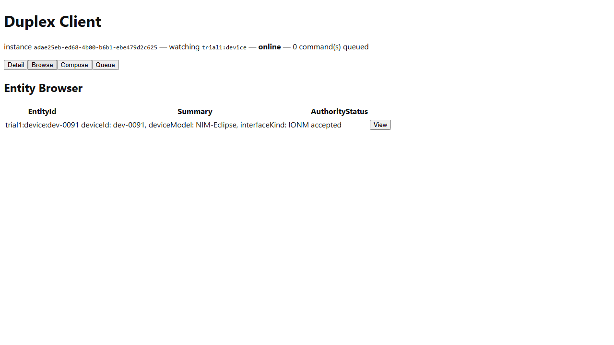

# Vitals -- Workflow B: Device Onboarding and Continuous Monitoring

_Generated by `EventStore.E2ETests` against a real running deployment -- re-run `dotnet test tests/EventStore.E2ETests` to regenerate. Don't hand-edit this file directly; edit the owning test's own step captions instead, or the content will be overwritten on the next run._

## Sequence Diagram

## Step 1. Opening the Vitals-Device instance of the Duplex Client -- a second, dedicated client-web instance launch-configured (ADR-039) to subscribe to the trial1 DeviceOnboarded event type, since the original client-web-vitals instance is locked to PatientScreened and can never Browse a Device entity.

## Step 2. Switching to the Browse tab. The seed continuity device dev-0091 (Samples.Vitals.Seed), paired to patient S-0091, is already present via REPLAY-mode catch-up.

## Step 3. Selecting dev-0091 opens its Detail view -- rendered generically via GenericFallbackView (ADR-039), since no ViewDefinition is registered for the "device" EntityType. Shows the device model (NIM-Eclipse), interface kind (IONM), the patient it's paired to (S-0091), and its site.

