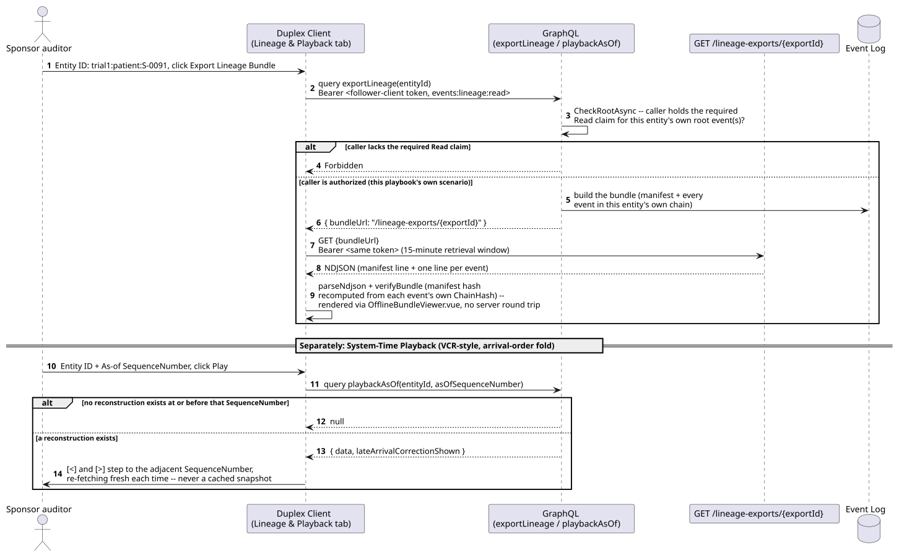
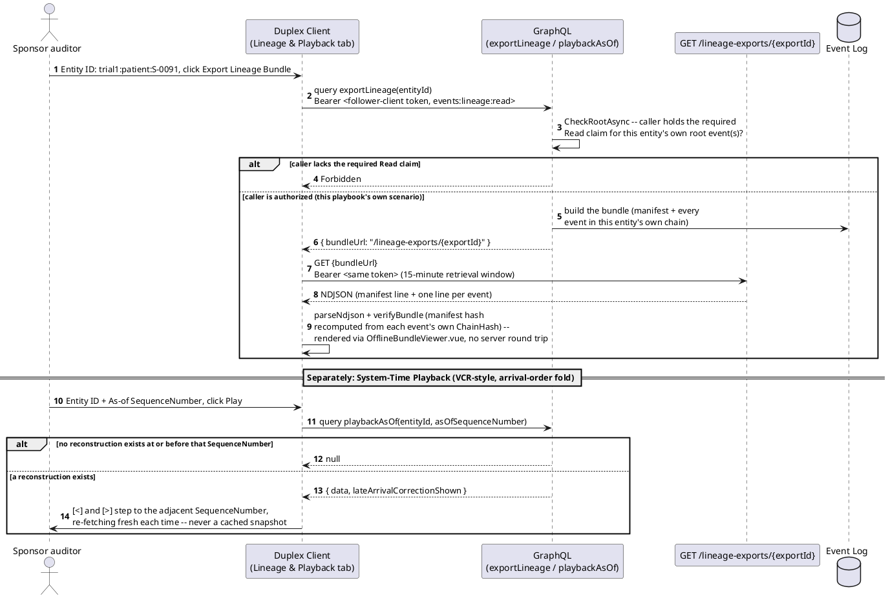

# Vitals -- Workflow C: Trial Data Export and Bitemporal Playback

_Generated by `EventStore.E2ETests` against a real running deployment -- re-run `dotnet test tests/EventStore.E2ETests` to regenerate. Don't hand-edit this file directly; edit the owning test's own step captions instead, or the content will be overwritten on the next run._

## Sequence Diagram

## Step 1. Opening the Lineage & Playback tab -- new this pass, and domain-agnostic (reachable from any client-web instance, not gated to a specific AppId the way the Queue/Relying-Party tabs are). Mirrors the feature doc's own Salt mockup: one Entity ID field feeds Export Lineage Bundle; a separate As-of SequenceNumber field feeds System-Time Playback.

## Step 2. Exporting the seed continuity subject's own lineage bundle. This runs the real exportLineage GraphQL query (events:lineage:read) against the live server, downloads the resulting NDJSON bundle from its own bundleUrl, and renders it directly on this screen via the already-built OfflineBundleViewer.vue -- the same offline-player verification screen a downloaded export's own standalone viewer uses, reused here rather than duplicated.

## Step 3. Viewing the full event list shows every event in this bundle's own chain, each with its own SequenceNumber, OccurredAt, and LateArrivalFlag, exactly as exported (no second masking/claims enforcement point, ADR-068's own "enforced once, at export time" rule).

## Step 4. System-Time Playback reconstructs this same entity as of SequenceNumber 11 -- its own very first event -- via the real playbackAsOf GraphQL query (BitemporalPlaybackControl.vue). The [<]/[>] controls step to the immediately adjacent SequenceNumber, each a fresh reconstruction against the live server, never a cached snapshot (ADR-068's own stated v1 scope).

![System-Time Playback reconstructs this same entity as of SequenceNumber 11 -- its own very first event -- via the real playbackAsOf GraphQL query (BitemporalPlaybackControl.vue). The [<]/[>] controls step to the immediately adjacent SequenceNumber, each a fresh reconstruction against the live server, never a cached snapshot (ADR-068's own stated v1 scope).](export-and-playback-lineage/step-04.png)

