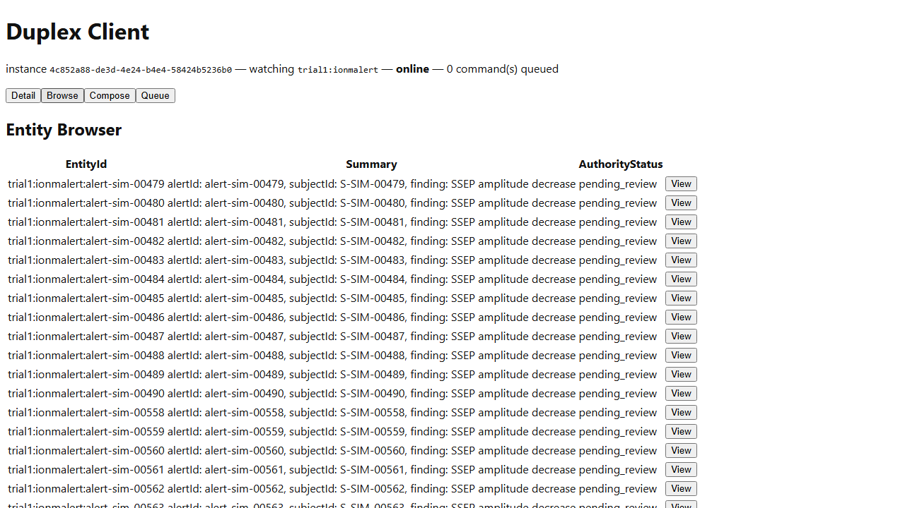

# Vitals -- Workflow D: Intraoperative Monitoring and Alert Response

_Generated by `EventStore.E2ETests` against a real running deployment -- re-run `dotnet test tests/EventStore.E2ETests` to regenerate. Don't hand-edit this file directly; edit the owning test's own step captions instead, or the content will be overwritten on the next run._

## Step 1. Opening the Vitals-IonmAlert instance of the Duplex Client -- a dedicated client-web instance launch-configured (ADR-039) to subscribe to the trial1 IonmAlertRaised event type, since neither the PatientScreened- nor DeviceOnboarded-subscribed instances can Browse an IonmAlert entity.

## Step 2. Switching to the Browse tab. The seed continuity alert alert-0091 (Samples.Vitals.Seed), raised for patient S-0091's IONM stream, is already present via REPLAY-mode catch-up.

## Step 3. Selecting alert-0091 opens its Detail view -- rendered generically via GenericFallbackView (ADR-039), since no ViewDefinition is registered for the "ionmalert" EntityType. This subscription's own payload type is IonmAlertRaised's, so the finding (SSEP amplitude decrease) and severity (High) render here -- IonmAlertAcknowledged's own AckedBy field isn't part of this payload shape, even though both events fold onto the same entity in the Entity Store itself (ADR-094's expected-response tracking).

